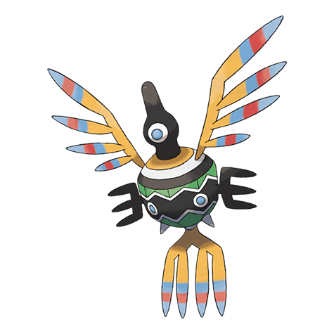

# Sigilyph (#0561)

*Avianoid Pokemon*

**Type:** Psico / Volante
**Abilities:** [[Wonder Skin]], [[Magic Guard]], [[Tinted Lens]] *(Hidden)*
**Base HP:** 4

> It is known that they worked as guards for an ancient civilization and a few can still be seen patrolling its borders, following the same route for centuries. They attack people that sneak through their barriers.

---

## Statistiche (Attributes & Limits)

| Attribute | Base / Limit |
|---|---|
| **Strength** | 2/4 |
| **Dexterity** | 3/6 |
| **Vitality** | 2/5 |
| **Special** | 3/6 |
| **Insight** | 2/5 |

---

## Mosse (Learnset)

- **Starter:** [[Gust|Gust]], [[Miracle_Eye|Miracle Eye]]
- **Beginner:** [[Hypnosis|Hypnosis]], [[Psywave|Psywave]], [[Tailwind|Tailwind]]
- **Amateur:** [[Whirlwind|Whirlwind]], [[Psybeam|Psybeam]], [[Air_Cutter|Air Cutter]], [[Light_Screen|Light Screen]], [[Reflect|Reflect]], [[Gravity|Gravity]], [[Mirror_Move|Mirror Move]], [[Psychic|Psychic]]
- **Ace:** [[Air_Slash|Air Slash]], [[Synchronoise|Synchronoise]], [[Cosmic_Power|Cosmic Power]], [[Sky_Attack|Sky Attack]]
- **Pro:** [[Stored_Power|Stored Power]], [[Telekinesis|Telekinesis]], [[Psycho_Shift|Psycho Shift]]

---

