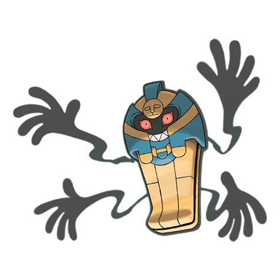

# Cofagrigus (#0563)

*Coffin Pokemon*

**Type:** Spettro
**Abilities:** [[Mummy]]
**Base HP:** 4

> This Pokemon has only been seen few times in the ruins and tombs of ancient civilizations. It curses and transforms people and Pokemon into mummy-like creatures. It is said it feeds on pure gold.

---

## Statistiche (Attributes & Limits)

| Attribute | Base / Limit |
|---|---|
| **Strength** | 2/4 |
| **Dexterity** | 1/3 |
| **Vitality** | 4/8 |
| **Special** | 3/6 |
| **Insight** | 3/6 |

---

## Mosse (Learnset)

- **Starter:** [[Astonish|Astonish]], [[Protect|Protect]]
- **Beginner:** [[Disable|Disable]], [[Haze|Haze]]
- **Amateur:** [[Night_Shade|Night Shade]], [[Hex|Hex]], [[Will_O_Wisp|Will-O-Wisp]], [[Ominous_Wind|Ominous Wind]], [[Curse|Curse]], [[Power_Split|Power Split]], [[Guard_Split|Guard Split]], [[Scary_Face|Scary Face]]
- **Ace:** [[Shadow_Ball|Shadow Ball]], [[Grudge|Grudge]], [[Mean_Look|Mean Look]], [[Destiny_Bond|Destiny Bond]]
- **Pro:** [[Imprison|Imprison]], [[Iron_Defense|Iron Defense]], [[Heal_Block|Heal Block]]

---

## Correlati

### Catena Evolutiva
- [[0562_Yamask|Yamask]]
- [[0563_Cofagrigus|Cofagrigus]]

