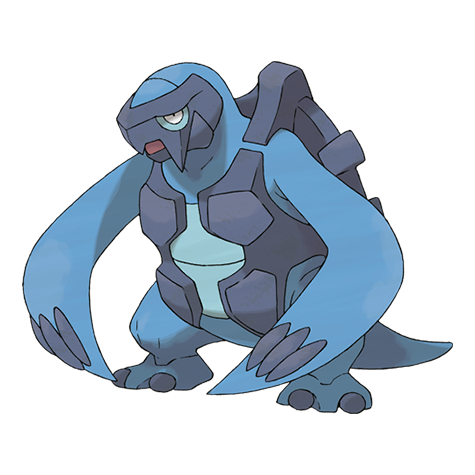

# Carracosta (#0565)

*Prototurtle Pokemon*

**Type:** Acqua / Roccia
**Abilities:** [[Solid Rock]], [[Sturdy]], [[Swift Swim]] *(Hidden)*
**Base HP:** 4

> They can live both in ocean and land. It can knock out a foe with a slap from one of its powerful front fins and chew it up whole. Fortunately, only one specimen on captivity remains.

---

## Statistiche (Attributes & Limits)

| Attribute | Base / Limit |
|---|---|
| **Strength** | 3/6 |
| **Dexterity** | 1/3 |
| **Vitality** | 3/7 |
| **Special** | 2/5 |
| **Insight** | 2/4 |

---

## Mosse (Learnset)

- **Starter:** [[Bide|Bide]], [[Withdraw|Withdraw]], [[Water_Gun|Water Gun]]
- **Beginner:** [[Rollout|Rollout]], [[Bite|Bite]], [[Protect|Protect]]
- **Amateur:** [[Aqua_Jet|Aqua Jet]], [[Ancient_Power|Ancient Power]], [[Crunch|Crunch]], [[Wide_Guard|Wide Guard]], [[Brine|Brine]], [[Smack_Down|Smack Down]], [[Curse|Curse]], [[Aqua_Tail|Aqua Tail]]
- **Ace:** [[Shell_Smash|Shell Smash]], [[Rock_Slide|Rock Slide]], [[Rain_Dance|Rain Dance]], [[Hydro_Pump|Hydro Pump]]
- **Pro:** [[Iron_Defense|Iron Defense]], [[Guard_Split|Guard Split]], [[Iron_Head|Iron Head]]

---

## Correlati

### Catena Evolutiva
- [[0564_Tirtouga|Tirtouga]]
- [[0565_Carracosta|Carracosta]]

