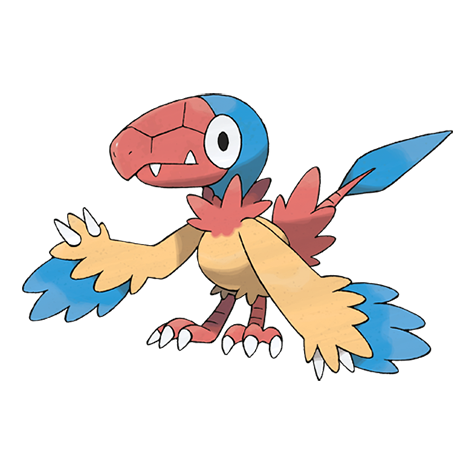

# Archen (#0566)

*First Bird Pokemon*

**Type:** Roccia / Volante
**Abilities:** [[Defeatist]]
**Base HP:** 3

> Revived from a fossil, this Pokemon is thought to be the ancestor of all bird Pokemon. Its flight abilities are poor so it just hops up by jumping. They are ill tempered and will not eat processed Pokemon food.

---

## Statistiche (Attributes & Limits)

| Attribute | Base / Limit |
|---|---|
| **Strength** | 3/6 |
| **Dexterity** | 2/5 |
| **Vitality** | 2/4 |
| **Special** | 2/5 |
| **Insight** | 2/4 |

---

## Mosse (Learnset)

- **Starter:** [[Quick_Attack|Quick Attack]], [[Leer|Leer]], [[Wing_Attack|Wing Attack]]
- **Beginner:** [[Rock_Throw|Rock Throw]], [[Double_Team|Double Team]], [[Scary_Face|Scary Face]]
- **Amateur:** [[Pluck|Pluck]], [[Ancient_Power|Ancient Power]], [[Agility|Agility]], [[Quick_Guard|Quick Guard]], [[Acrobatics|Acrobatics]], [[Dragon_Breath|Dragon Breath]], [[Crunch|Crunch]], [[Endeavor|Endeavor]], [[U_Turn|U-Turn]]
- **Ace:** [[Rock_Slide|Rock Slide]], [[Dragon_Claw|Dragon Claw]], [[Thrash|Thrash]]
- **Pro:** [[Steel_Wing|Steel Wing]], [[Bounce|Bounce]], [[Knock_Off|Knock Off]]

---

## Correlati

### Catena Evolutiva
- [[0566_Archen|Archen]]
- [[0567_Archeops|Archeops]]

