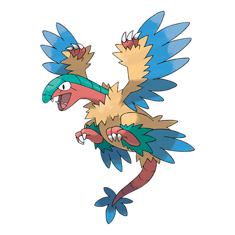

# Archeops (#0567)

*First Bird Pokemon*

**Type:** Roccia / Volante
**Abilities:** [[Defeatist]]
**Base HP:** 4

> They used to form groups that cooperated to catch prey. From the ground, they used a running start to take flight. It is believed that they got extinct due to their poor tolerance to pain.

---

## Statistiche (Attributes & Limits)

| Attribute | Base / Limit |
|---|---|
| **Strength** | 3/7 |
| **Dexterity** | 3/6 |
| **Vitality** | 2/4 |
| **Special** | 3/6 |
| **Insight** | 2/4 |

---

## Mosse (Learnset)

- **Starter:** [[Quick_Attack|Quick Attack]], [[Leer|Leer]], [[Wing_Attack|Wing Attack]]
- **Beginner:** [[Rock_Throw|Rock Throw]], [[Double_Team|Double Team]], [[Scary_Face|Scary Face]]
- **Amateur:** [[Pluck|Pluck]], [[Ancient_Power|Ancient Power]], [[Agility|Agility]], [[Quick_Guard|Quick Guard]], [[Acrobatics|Acrobatics]], [[Dragon_Breath|Dragon Breath]], [[Crunch|Crunch]], [[Endeavor|Endeavor]], [[U_Turn|U-Turn]]
- **Ace:** [[Rock_Slide|Rock Slide]], [[Dragon_Claw|Dragon Claw]], [[Thrash|Thrash]]
- **Pro:** [[Iron_Defense|Iron Defense]], [[Sky_Attack|Sky Attack]], [[Head_Smash|Head Smash]]

---

## Correlati

### Catena Evolutiva
- [[0566_Archen|Archen]]
- [[0567_Archeops|Archeops]]

