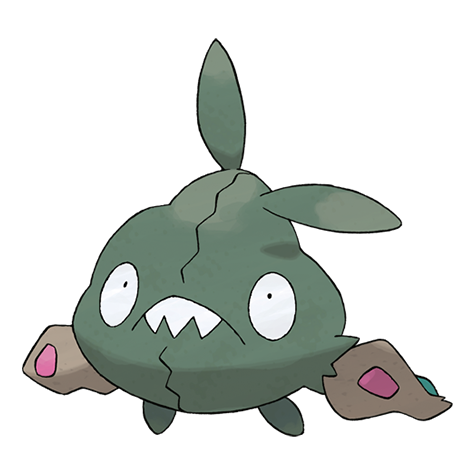

# Trubbish (#0568)

*Trash Bag Pokemon*

**Type:** Veleno
**Abilities:** [[Stench]], [[Sticky Hold]], [[Aftermath]] *(Hidden)*
**Base HP:** 3

> The combination of garbage bags and industrial waste caused the chemical reaction that created this Pokemon. It belches a poison gas, breathing it will leave you sick in bed for a week. It loves filthy places.

---

## Statistiche (Attributes & Limits)

| Attribute | Base / Limit |
|---|---|
| **Strength** | 2/4 |
| **Dexterity** | 2/4 |
| **Vitality** | 2/4 |
| **Special** | 1/3 |
| **Insight** | 2/4 |

---

## Mosse (Learnset)

- **Starter:** [[Pound|Pound]], [[Poison_Gas|Poison Gas]]
- **Beginner:** [[Recycle|Recycle]], [[Toxic_Spikes|Toxic Spikes]]
- **Amateur:** [[Acid_Spray|Acid Spray]], [[Double_Slap|Double Slap]], [[Sludge|Sludge]], [[Stockpile|Stockpile]], [[Swallow|Swallow]], [[Take_Down|Take Down]], [[Sludge_Bomb|Sludge Bomb]], [[Clear_Smog|Clear Smog]], [[Toxic|Toxic]]
- **Ace:** [[Amnesia|Amnesia]], [[Belch|Belch]], [[Gunk_Shot|Gunk Shot]], [[Explosion|Explosion]]
- **Pro:** [[Drain_Punch|Drain Punch]], [[Spikes|Spikes]], [[Rollout|Rollout]]

---

## Correlati

### Catena Evolutiva
- [[0568_Trubbish|Trubbish]]
- [[0569_Garbodor|Garbodor]]

