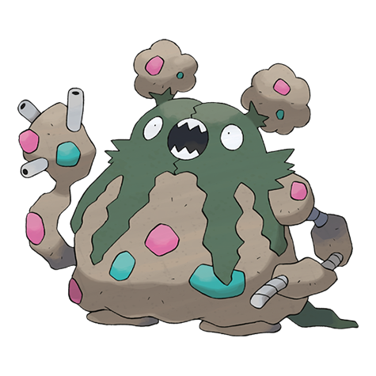

# Garbodor (#0569)

*Trash Heap Pokemon*

**Type:** Veleno
**Abilities:** [[Stench]], [[Weak Armor]], [[Aftermath]] *(Hidden)*
**Base HP:** 4

> They absorb garbage to make it part of their bodies and use it to produce toxic substances from their finger tips. They like to remain undisturbed and produce a terrible smell to repel others.

---

## Statistiche (Attributes & Limits)

| Attribute | Base / Limit |
|---|---|
| **Strength** | 3/6 |
| **Dexterity** | 2/5 |
| **Vitality** | 2/5 |
| **Special** | 2/4 |
| **Insight** | 2/5 |

---

## Mosse (Learnset)

- **Starter:** [[Pound|Pound]], [[Poison_Gas|Poison Gas]]
- **Beginner:** [[Recycle|Recycle]], [[Toxic_Spikes|Toxic Spikes]]
- **Amateur:** [[Acid_Spray|Acid Spray]], [[Double_Slap|Double Slap]], [[Sludge|Sludge]], [[Stockpile|Stockpile]], [[Swallow|Swallow]], [[Body_Slam|Body Slam]], [[Sludge_Bomb|Sludge Bomb]], [[Clear_Smog|Clear Smog]], [[Toxic|Toxic]]
- **Ace:** [[Amnesia|Amnesia]], [[Belch|Belch]], [[Gunk_Shot|Gunk Shot]], [[Explosion|Explosion]]
- **Pro:** [[Drain_Punch|Drain Punch]], [[Spikes|Spikes]], [[Rollout|Rollout]]

---

## Correlati

### Catena Evolutiva
- [[0568_Trubbish|Trubbish]]
- [[0569_Garbodor|Garbodor]]

