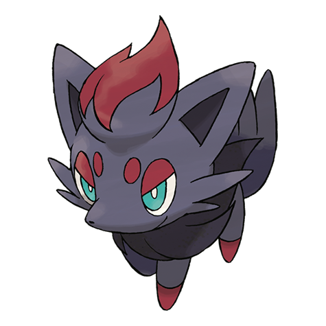

# Zorua (#0570)

*Tricky Fox Pokemon*

**Type:** Buio
**Abilities:** [[Illusion]]
**Base HP:** 3

> They are very hard to find as they can transform into people and other Pokemon. They cannot speak when transformed and their tail remains visible. They ruin reputations by creating mischief in disguise.

---

## Statistiche (Attributes & Limits)

| Attribute | Base / Limit |
|---|---|
| **Strength** | 2/4 |
| **Dexterity** | 2/4 |
| **Vitality** | 1/3 |
| **Special** | 2/5 |
| **Insight** | 1/3 |

---

## Mosse (Learnset)

- **Starter:** [[Scratch|Scratch]], [[Leer|Leer]]
- **Beginner:** [[Pursuit|Pursuit]], [[Fake_Tears|Fake Tears]]
- **Amateur:** [[Fury_Swipes|Fury Swipes]], [[Feint_Attack|Feint Attack]], [[Scary_Face|Scary Face]], [[Taunt|Taunt]], [[Foul_Play|Foul Play]], [[Torment|Torment]], [[Agility|Agility]], [[Embargo|Embargo]]
- **Ace:** [[Punishment|Punishment]], [[Nasty_Plot|Nasty Plot]], [[Imprison|Imprison]], [[Night_Daze|Night Daze]]
- **Pro:** [[Extrasensory|Extrasensory]], [[Detect|Detect]], [[Sucker_Punch|Sucker Punch]]

---

## Correlati

### Catena Evolutiva
- [[0570_Zorua|Zorua]]
- [[0571_Zoroark|Zoroark]]

