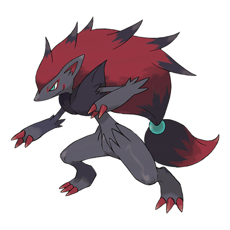

# Zoroark (#0571)

*Illusion Fox Pokemon*

**Type:** Buio
**Abilities:** [[Illusion]]
**Base HP:** 4

> They live in groups, their lair’s entrance is protected with their illusions and mirages. They have been known to fool entire towns with their tricks. Their illusions can hide their tails now but they remain mute.

---

## Statistiche (Attributes & Limits)

| Attribute | Base / Limit |
|---|---|
| **Strength** | 3/6 |
| **Dexterity** | 3/6 |
| **Vitality** | 2/4 |
| **Special** | 3/7 |
| **Insight** | 2/4 |

---

## Mosse (Learnset)

- **Starter:** [[Leer|Leer]], [[Scratch|Scratch]]
- **Beginner:** [[Hone_Claws|Hone Claws]], [[Pursuit|Pursuit]]
- **Amateur:** [[Agility|Agility]], [[Embargo|Embargo]], [[U_Turn|U-Turn]], [[Fury_Swipes|Fury Swipes]], [[Feint_Attack|Feint Attack]], [[Scary_Face|Scary Face]], [[Taunt|Taunt]], [[Foul_Play|Foul Play]], [[Night_Slash|Night Slash]], [[Torment|Torment]]
- **Ace:** [[Night_Daze|Night Daze]], [[Imprison|Imprison]], [[Punishment|Punishment]], [[Nasty_Plot|Nasty Plot]]
- **Pro:** [[Extrasensory|Extrasensory]], [[Detect|Detect]], [[Sucker_Punch|Sucker Punch]]

---

## Correlati

### Catena Evolutiva
- [[0570_Zorua|Zorua]]
- [[0571_Zoroark|Zoroark]]

