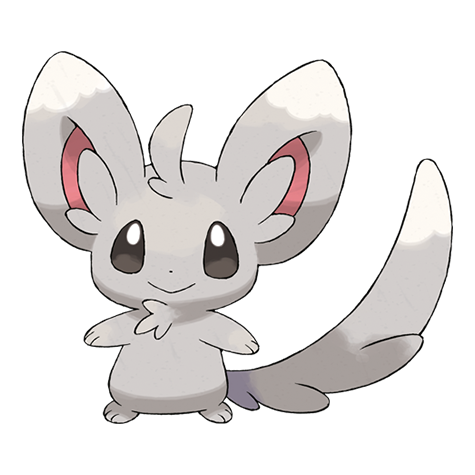

# Minccino (#0572)

*Chinchilla Pokemon*

**Type:** Normale
**Abilities:** [[Cute Charm]], [[Technician]], [[Skill Link]] *(Hidden)*
**Base HP:** 3

> They greet one another by rubbing their tails, which are always kept well groomed and clean. Housewives love to keep them as pets because they eagerly help to clean the house.

---

## Statistiche (Attributes & Limits)

| Attribute | Base / Limit |
|---|---|
| **Strength** | 2/4 |
| **Dexterity** | 2/5 |
| **Vitality** | 1/3 |
| **Special** | 1/3 |
| **Insight** | 1/3 |

---

## Mosse (Learnset)

- **Starter:** [[Pound|Pound]], [[Baby_Doll_Eyes|Baby-Doll Eyes]]
- **Beginner:** [[Helping_Hand|Helping Hand]], [[Tickle|Tickle]]
- **Amateur:** [[Double_Slap|Double Slap]], [[Encore|Encore]], [[Swift|Swift]], [[Sing|Sing]], [[Tail_Slap|Tail Slap]], [[Charm|Charm]], [[Wake_Up_Slap|Wake-Up Slap]], [[Echoed_Voice|Echoed Voice]], [[Captivate|Captivate]]
- **Ace:** [[Slam|Slam]], [[Hyper_Voice|Hyper Voice]], [[Last_Resort|Last Resort]], [[After_You|After You]]
- **Pro:** [[Aqua_Tail|Aqua Tail]], [[Iron_Tail|Iron Tail]], [[Seed_Bomb|Seed Bomb]]

---

## Correlati

### Catena Evolutiva
- [[0572_Minccino|Minccino]]
- [[0573_Cinccino|Cinccino]]

