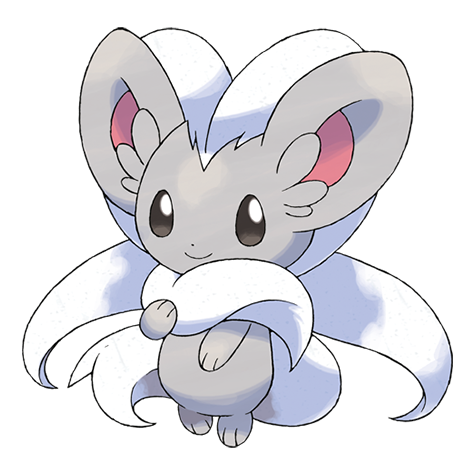

# Cinccino (#0573)

*Scarf Pokemon*

**Type:** Normale
**Abilities:** [[Cute Charm]], [[Technician]], [[Skill Link]] *(Hidden)*
**Base HP:** 4

> Their fur feels amazing to the touch. It produces an oil that repels dust and prevents static electricity from building up. It loves to be groomed and pampered. The fur it sheds is highly valued.

---

## Statistiche (Attributes & Limits)

| Attribute | Base / Limit |
|---|---|
| **Strength** | 3/6 |
| **Dexterity** | 3/6 |
| **Vitality** | 2/4 |
| **Special** | 2/4 |
| **Insight** | 2/4 |

---

## Mosse (Learnset)

- **Beginner:** [[Helping_Hand|Helping Hand]], [[Tickle|Tickle]]
- **Amateur:** [[Bullet_Seed|Bullet Seed]], [[Rock_Blast|Rock Blast]], [[Sing|Sing]], [[Tail_Slap|Tail Slap]]
- **Pro:** [[Aqua_Tail|Aqua Tail]], [[Iron_Tail|Iron Tail]], [[Fake_Tears|Fake Tears]]

---

## Correlati

### Catena Evolutiva
- [[0572_Minccino|Minccino]]
- [[0573_Cinccino|Cinccino]]

