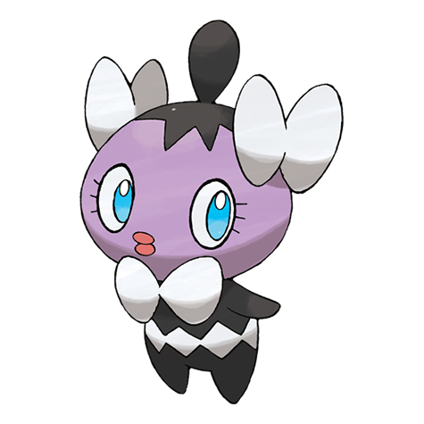

# Gothita (#0574)

*Fixation Pokemon*

**Type:** Psico
**Abilities:** [[Frisk]], [[Competitive]], [[Shadow Tag]] *(Hidden)*
**Base HP:** 3

> They continuously observe both Trainers and Pokemon. Apparently, they are looking at something that only they can see. The ribbon-like feelers on their body increase their psychic power.

---

## Statistiche (Attributes & Limits)

| Attribute | Base / Limit |
|---|---|
| **Strength** | 1/3 |
| **Dexterity** | 2/4 |
| **Vitality** | 2/4 |
| **Special** | 2/4 |
| **Insight** | 2/4 |

---

## Mosse (Learnset)

- **Starter:** [[Pound|Pound]], [[Confusion|Confusion]]
- **Beginner:** [[Tickle|Tickle]], [[Play_Nice|Play Nice]], [[Fake_Tears|Fake Tears]]
- **Amateur:** [[Double_Slap|Double Slap]], [[Psybeam|Psybeam]], [[Embargo|Embargo]], [[Feint_Attack|Feint Attack]], [[Psyshock|Psyshock]], [[Flatter|Flatter]], [[Future_Sight|Future Sight]], [[Heal_Block|Heal Block]]
- **Ace:** [[Psychic|Psychic]], [[Telekinesis|Telekinesis]], [[Charm|Charm]], [[Magic_Room|Magic Room]]
- **Pro:** [[Role_Play|Role Play]], [[Signal_Beam|Signal Beam]], [[Snatch|Snatch]]

---

## Correlati

### Catena Evolutiva
- [[0574_Gothita|Gothita]]
- [[0575_Gothorita|Gothorita]]
- [[0576_Gothitelle|Gothitelle]]

