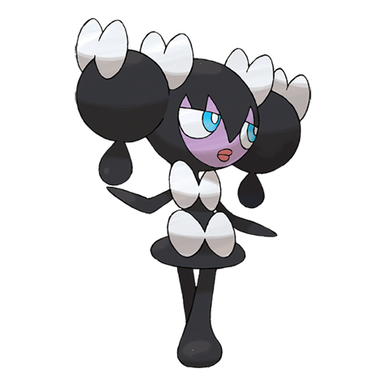

# Gothorita (#0575)

*Manipulate Pokemon*

**Type:** Psico
**Abilities:** [[Frisk]], [[Competitive]], [[Shadow Tag]] *(Hidden)*
**Base HP:** 4

> Starlight is the source of their power. At night, they mark star positions by using floating stones. According to many old tales, it creates friends for itself by controlling sleeping children on starry nights.

---

## Statistiche (Attributes & Limits)

| Attribute | Base / Limit |
|---|---|
| **Strength** | 2/4 |
| **Dexterity** | 2/4 |
| **Vitality** | 2/5 |
| **Special** | 2/5 |
| **Insight** | 2/5 |

---

## Mosse (Learnset)

- **Starter:** [[Pound|Pound]], [[Confusion|Confusion]]
- **Beginner:** [[Tickle|Tickle]], [[Play_Nice|Play Nice]], [[Fake_Tears|Fake Tears]]
- **Amateur:** [[Double_Slap|Double Slap]], [[Psybeam|Psybeam]], [[Embargo|Embargo]], [[Feint_Attack|Feint Attack]], [[Psyshock|Psyshock]], [[Flatter|Flatter]], [[Future_Sight|Future Sight]], [[Heal_Block|Heal Block]]
- **Ace:** [[Psychic|Psychic]], [[Telekinesis|Telekinesis]], [[Charm|Charm]], [[Magic_Room|Magic Room]]
- **Pro:** [[Role_Play|Role Play]], [[Signal_Beam|Signal Beam]], [[Snatch|Snatch]]

---

## Correlati

### Catena Evolutiva
- [[0574_Gothita|Gothita]]
- [[0575_Gothorita|Gothorita]]
- [[0576_Gothitelle|Gothitelle]]

