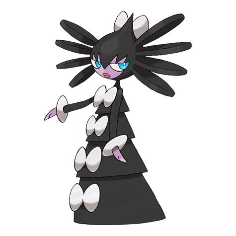

# Gothitelle (#0576)

*Astral Body Pokemon*

**Type:** Psico
**Abilities:** [[Frisk]], [[Competitive]], [[Shadow Tag]] *(Hidden)*
**Base HP:** 5

> They can predict the future from the placement and movement of the stars. They get restless if someone they know will be in danger. They are emphatic creatures that can understand human emotion.

---

## Statistiche (Attributes & Limits)

| Attribute | Base / Limit |
|---|---|
| **Strength** | 2/4 |
| **Dexterity** | 2/4 |
| **Vitality** | 3/6 |
| **Special** | 3/6 |
| **Insight** | 3/6 |

---

## Mosse (Learnset)

- **Starter:** [[Pound|Pound]], [[Confusion|Confusion]]
- **Beginner:** [[Tickle|Tickle]], [[Play_Nice|Play Nice]], [[Fake_Tears|Fake Tears]]
- **Amateur:** [[Double_Slap|Double Slap]], [[Psybeam|Psybeam]], [[Embargo|Embargo]], [[Feint_Attack|Feint Attack]], [[Psyshock|Psyshock]], [[Flatter|Flatter]], [[Future_Sight|Future Sight]], [[Heal_Block|Heal Block]]
- **Ace:** [[Psychic|Psychic]], [[Telekinesis|Telekinesis]], [[Charm|Charm]], [[Magic_Room|Magic Room]]
- **Pro:** [[Heal_Pulse|Heal Pulse]], [[Helping_Hand|Helping Hand]], [[Dark_Pulse|Dark Pulse]]

---

## Correlati

### Catena Evolutiva
- [[0574_Gothita|Gothita]]
- [[0575_Gothorita|Gothorita]]
- [[0576_Gothitelle|Gothitelle]]

