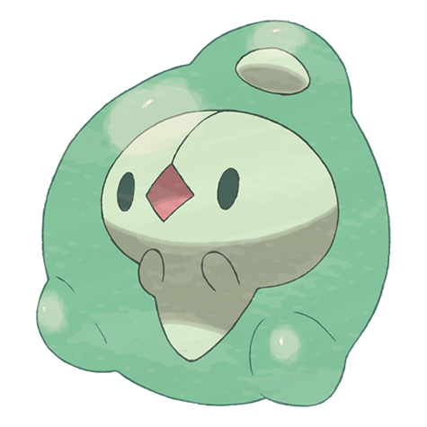

# Duosion (#0578)

*Mitosis Pokemon*

**Type:** Psico
**Abilities:** [[Overcoat]], [[Magic Guard]], [[Regenerator]] *(Hidden)*
**Base HP:** 4

> It developed two brains when it evolved, due to this it has a split personality. At times it may suddenly try to take two different actions at once. When the two brains finally synchronize it shows it’s max power.

---

## Statistiche (Attributes & Limits)

| Attribute | Base / Limit |
|---|---|
| **Strength** | 1/3 |
| **Dexterity** | 1/3 |
| **Vitality** | 2/4 |
| **Special** | 3/7 |
| **Insight** | 2/4 |

---

## Mosse (Learnset)

- **Starter:** [[Psywave|Psywave]], [[Reflect|Reflect]]
- **Beginner:** [[Rollout|Rollout]], [[Snatch|Snatch]]
- **Amateur:** [[Hidden_Power|Hidden Power]], [[Light_Screen|Light Screen]], [[Charm|Charm]], [[Recover|Recover]], [[Psyshock|Psyshock]], [[Endeavor|Endeavor]], [[Psychic|Psychic]], [[Pain_Split|Pain Split]]
- **Ace:** [[Future_Sight|Future Sight]], [[Skill_Swap|Skill Swap]], [[Heal_Block|Heal Block]], [[Wonder_Room|Wonder Room]]
- **Pro:** [[Acid_Armor|Acid Armor]], [[Night_Shade|Night Shade]], [[Confuse_Ray|Confuse Ray]]

---

## Correlati

### Catena Evolutiva
- [[0577_Solosis|Solosis]]
- [[0578_Duosion|Duosion]]
- [[0579_Reuniclus|Reuniclus]]

