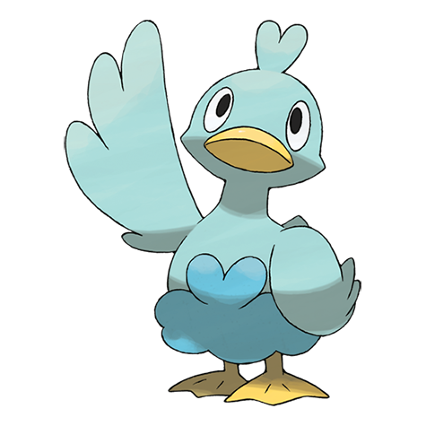

# Ducklett (#0580)

*Water Bird Pokemon*

**Type:** Acqua / Volante
**Abilities:** [[Keen Eye]], [[Big Pecks]], [[Hydration]] *(Hidden)*
**Base HP:** 3

> These bird Pokemon are excellent divers. They swim around in the water eating their favorite food, peat moss. They can shoot a spray mist with their feathers to protect from any predator that comes.

---

## Statistiche (Attributes & Limits)

| Attribute | Base / Limit |
|---|---|
| **Strength** | 1/3 |
| **Dexterity** | 2/4 |
| **Vitality** | 2/4 |
| **Special** | 1/3 |
| **Insight** | 2/4 |

---

## Mosse (Learnset)

- **Starter:** [[Water_Gun|Water Gun]], [[Water_Sport|Water Sport]]
- **Beginner:** [[Defog|Defog]], [[Wing_Attack|Wing Attack]]
- **Amateur:** [[Water_Pulse|Water Pulse]], [[Aerial_Ace|Aerial Ace]], [[Bubble_Beam|Bubble Beam]], [[Feather_Dance|Feather Dance]], [[Aqua_Ring|Aqua Ring]], [[Air_Slash|Air Slash]], [[Roost|Roost]]
- **Ace:** [[Rain_Dance|Rain Dance]], [[Tailwind|Tailwind]], [[Brave_Bird|Brave Bird]], [[Hurricane|Hurricane]]
- **Pro:** [[Mud_Sport|Mud Sport]], [[Steel_Wing|Steel Wing]], [[Mirror_Move|Mirror Move]]

---

## Correlati

### Catena Evolutiva
- [[0580_Ducklett|Ducklett]]
- [[0581_Swanna|Swanna]]

