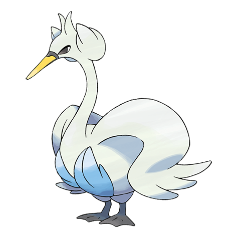

# Swanna (#0581)

*White Bird Pokemon*

**Type:** Acqua / Volante
**Abilities:** [[Keen Eye]], [[Big Pecks]], [[Hydration]] *(Hidden)*
**Base HP:** 4

> Swanna come out to dance at dusk. The one dancing in the middle is the leader of the flock. Despite their elegant and frail appearance, they can flap their wings strongly and fly for thousands of miles.

---

## Statistiche (Attributes & Limits)

| Attribute | Base / Limit |
|---|---|
| **Strength** | 2/5 |
| **Dexterity** | 3/6 |
| **Vitality** | 2/5 |
| **Special** | 2/5 |
| **Insight** | 2/4 |

---

## Mosse (Learnset)

- **Starter:** [[Water_Gun|Water Gun]], [[Water_Sport|Water Sport]]
- **Beginner:** [[Defog|Defog]], [[Wing_Attack|Wing Attack]]
- **Amateur:** [[Water_Pulse|Water Pulse]], [[Aerial_Ace|Aerial Ace]], [[Bubble_Beam|Bubble Beam]], [[Feather_Dance|Feather Dance]], [[Aqua_Ring|Aqua Ring]], [[Air_Slash|Air Slash]], [[Roost|Roost]]
- **Ace:** [[Rain_Dance|Rain Dance]], [[Tailwind|Tailwind]], [[Brave_Bird|Brave Bird]], [[Hurricane|Hurricane]]
- **Pro:** [[Mud_Sport|Mud Sport]], [[Lucky_Chant|Lucky Chant]], [[Mirror_Move|Mirror Move]]

---

## Correlati

### Catena Evolutiva
- [[0580_Ducklett|Ducklett]]
- [[0581_Swanna|Swanna]]

