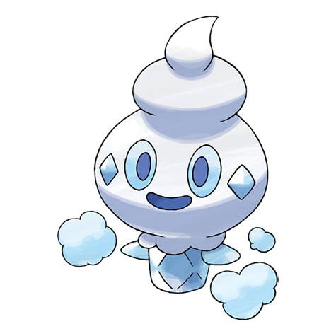

# Vanillite (#0582)

*Fresh Snow Pokemon*

**Type:** Ghiaccio
**Abilities:** [[Ice Body]], [[Snow Cloak]], [[Weak Armor]] *(Hidden)*
**Base HP:** 3

> This Pokemon were born from icicles that bathed in the energy of the morning sun. It uses snow to cover its head and protect it from melting. They are playful and love to make snow fall around them.

---

## Statistiche (Attributes & Limits)

| Attribute | Base / Limit |
|---|---|
| **Strength** | 2/4 |
| **Dexterity** | 1/3 |
| **Vitality** | 2/4 |
| **Special** | 2/4 |
| **Insight** | 2/4 |

---

## Mosse (Learnset)

- **Starter:** [[Icicle_Spear|Icicle Spear]], [[Harden|Harden]]
- **Beginner:** [[Astonish|Astonish]], [[Uproar|Uproar]]
- **Amateur:** [[Icy_Wind|Icy Wind]], [[Mist|Mist]], [[Avalanche|Avalanche]], [[Taunt|Taunt]], [[Mirror_Shot|Mirror Shot]], [[Acid_Armor|Acid Armor]], [[Ice_Beam|Ice Beam]]
- **Ace:** [[Hail|Hail]], [[Mirror_Coat|Mirror Coat]], [[Blizzard|Blizzard]], [[Sheer_Cold|Sheer Cold]]
- **Pro:** [[Ice_Shard|Ice Shard]], [[Autotomize|Autotomize]], [[Water_Pulse|Water Pulse]]

---

## Correlati

### Catena Evolutiva
- [[0582_Vanillite|Vanillite]]
- [[0583_Vanillish|Vanillish]]
- [[0584_Vanilluxe|Vanilluxe]]

