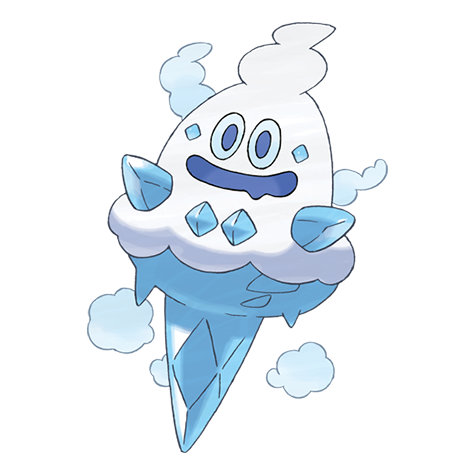

# Vanillish (#0583)

*Icy Snow Pokemon*

**Type:** Ghiaccio
**Abilities:** [[Ice Body]], [[Snow Cloak]], [[Weak Armor]] *(Hidden)*
**Base HP:** 4

> Snowy mountains are this Pokemon’s habitat. It conceals itself from enemy eyes by creating many small ice bundles and hiding around them. It may attach itself to the ceiling of ice caves to hide around the ice.

---

## Statistiche (Attributes & Limits)

| Attribute | Base / Limit |
|---|---|
| **Strength** | 2/4 |
| **Dexterity** | 1/3 |
| **Vitality** | 2/4 |
| **Special** | 2/5 |
| **Insight** | 2/5 |

---

## Mosse (Learnset)

- **Starter:** [[Icicle_Spear|Icicle Spear]], [[Harden|Harden]]
- **Beginner:** [[Astonish|Astonish]], [[Uproar|Uproar]]
- **Amateur:** [[Icy_Wind|Icy Wind]], [[Mist|Mist]], [[Avalanche|Avalanche]], [[Taunt|Taunt]], [[Mirror_Shot|Mirror Shot]], [[Acid_Armor|Acid Armor]], [[Ice_Beam|Ice Beam]]
- **Ace:** [[Hail|Hail]], [[Mirror_Coat|Mirror Coat]], [[Blizzard|Blizzard]], [[Sheer_Cold|Sheer Cold]]
- **Pro:** [[Ice_Shard|Ice Shard]], [[Autotomize|Autotomize]], [[Water_Pulse|Water Pulse]]

---

## Correlati

### Catena Evolutiva
- [[0582_Vanillite|Vanillite]]
- [[0583_Vanillish|Vanillish]]
- [[0584_Vanilluxe|Vanilluxe]]

