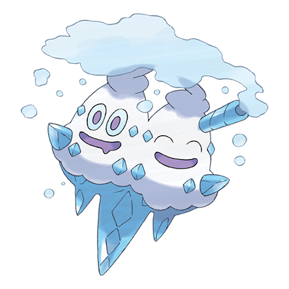

# Vanilluxe (#0584)

*Snowstorm Pokemon*

**Type:** Ghiaccio
**Abilities:** [[Ice Body]], [[Snow Warning]], [[Weak Armor]] *(Hidden)*
**Base HP:** 5

> It grew a new head with evolution, and they get along really well. They need to drink a lot of water in order to keep cool outside a gelid weather. If both heads get angry they will expel a terrible blizzard around.

---

## Statistiche (Attributes & Limits)

| Attribute | Base / Limit |
|---|---|
| **Strength** | 3/6 |
| **Dexterity** | 2/5 |
| **Vitality** | 2/5 |
| **Special** | 3/6 |
| **Insight** | 3/6 |

---

## Mosse (Learnset)

- **Starter:** [[Harden|Harden]], [[Icicle_Spear|Icicle Spear]]
- **Beginner:** [[Uproar|Uproar]], [[Astonish|Astonish]]
- **Amateur:** [[Freeze_Dry|Freeze Dry]], [[Icy_Wind|Icy Wind]], [[Mist|Mist]], [[Avalanche|Avalanche]], [[Taunt|Taunt]], [[Mirror_Shot|Mirror Shot]], [[Acid_Armor|Acid Armor]], [[Ice_Beam|Ice Beam]]
- **Ace:** [[Hail|Hail]], [[Mirror_Coat|Mirror Coat]], [[Blizzard|Blizzard]], [[Sheer_Cold|Sheer Cold]]
- **Pro:** [[Autotomize|Autotomize]], [[Iron_Defense|Iron Defense]], [[Ice_Shard|Ice Shard]]

---

## Correlati

### Catena Evolutiva
- [[0582_Vanillite|Vanillite]]
- [[0583_Vanillish|Vanillish]]
- [[0584_Vanilluxe|Vanilluxe]]

