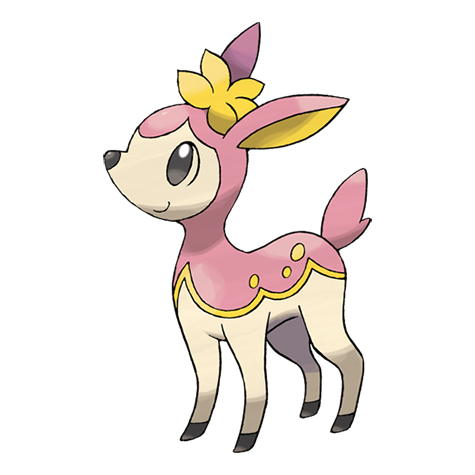

# Deerling (#0585)

*Season Pokemon*

**Type:** Normale / Erba
**Abilities:** [[Chlorophyll]], [[Sap Sipper]], [[Serene Grace]] *(Hidden)*
**Base HP:** 3

> They are born at the beginning of the spring. Their coloring changes according to the season and can be affected by temperature as well. It usually stays hidden in tall grass while its mother is away.

---

## Statistiche (Attributes & Limits)

| Attribute | Base / Limit |
|---|---|
| **Strength** | 2/4 |
| **Dexterity** | 2/5 |
| **Vitality** | 2/4 |
| **Special** | 1/3 |
| **Insight** | 2/4 |

---

## Mosse (Learnset)

- **Starter:** [[Tackle|Tackle]], [[Camouflage|Camouflage]]
- **Beginner:** [[Growl|Growl]], [[Sand_Attack|Sand Attack]], [[Double_Kick|Double Kick]]
- **Amateur:** [[Leech_Seed|Leech Seed]], [[Feint_Attack|Feint Attack]], [[Take_Down|Take Down]], [[Jump_Kick|Jump Kick]], [[Aromatherapy|Aromatherapy]], [[Energy_Ball|Energy Ball]], [[Charm|Charm]]
- **Ace:** [[Nature_Power|Nature Power]], [[Double_Edge|Double-Edge]], [[Solar_Beam|Solar Beam]]
- **Pro:** [[Agility|Agility]], [[Bounce|Bounce]], [[Grass_Whistle|Grass Whistle]]

---

## Correlati

### Catena Evolutiva
- [[0585_Deerling|Deerling]]
- [[0586_Sawsbuck|Sawsbuck]]

