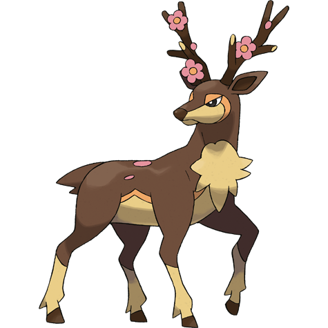

# Sawsbuck (#0586)

*Season Pokemon*

**Type:** Normale / Erba
**Abilities:** [[Chlorophyll]], [[Sap Sipper]], [[Serene Grace]] *(Hidden)*
**Base HP:** 4

> The plants growing on its horns change according to the season. They live in herds that migrate in search of grass. The leaders of the herd possess magnificent horns. They tend to be peaceful creatures.

---

## Statistiche (Attributes & Limits)

| Attribute | Base / Limit |
|---|---|
| **Strength** | 3/6 |
| **Dexterity** | 3/6 |
| **Vitality** | 2/5 |
| **Special** | 2/4 |
| **Insight** | 2/5 |

---

## Mosse (Learnset)

- **Starter:** [[Camouflage|Camouflage]], [[Tackle|Tackle]]
- **Beginner:** [[Growl|Growl]], [[Sand_Attack|Sand Attack]], [[Horn_Leech|Horn Leech]]
- **Amateur:** [[Double_Kick|Double Kick]], [[Leech_Seed|Leech Seed]], [[Feint_Attack|Feint Attack]], [[Take_Down|Take Down]], [[Jump_Kick|Jump Kick]], [[Aromatherapy|Aromatherapy]], [[Energy_Ball|Energy Ball]], [[Charm|Charm]]
- **Ace:** [[Megahorn|Megahorn]], [[Nature_Power|Nature Power]], [[Double_Edge|Double-Edge]], [[Solar_Beam|Solar Beam]]
- **Pro:** [[Agility|Agility]], [[Bounce|Bounce]], [[Last_Resort|Last Resort]]

---

## Correlati

### Catena Evolutiva
- [[0585_Deerling|Deerling]]
- [[0586_Sawsbuck|Sawsbuck]]

