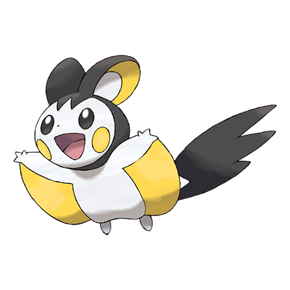

# Emolga (#0587)

*Sky Squirrel Pokemon*

**Type:** Elettro / Volante
**Abilities:** [[Static]], [[Motor Drive]] *(Hidden)*
**Base HP:** 4

> They live on treetops and glide using the inside of a cape-like membrane. They discharge electricity to defend from other Pokemon. They carry nuts and berries back to their nest to eat during the winter.

---

## Statistiche (Attributes & Limits)

| Attribute | Base / Limit |
|---|---|
| **Strength** | 2/5 |
| **Dexterity** | 3/6 |
| **Vitality** | 2/4 |
| **Special** | 2/5 |
| **Insight** | 2/4 |

---

## Mosse (Learnset)

- **Starter:** [[Thunder_Shock|Thunder Shock]], [[Quick_Attack|Quick Attack]]
- **Beginner:** [[Tail_Whip|Tail Whip]], [[Charge|Charge]]
- **Amateur:** [[Spark|Spark]], [[Nuzzle|Nuzzle]], [[Pursuit|Pursuit]], [[Double_Team|Double Team]], [[Shock_Wave|Shock Wave]], [[Electro_Ball|Electro Ball]], [[Acrobatics|Acrobatics]], [[Light_Screen|Light Screen]]
- **Ace:** [[Encore|Encore]], [[Volt_Switch|Volt Switch]], [[Agility|Agility]], [[Discharge|Discharge]]
- **Pro:** [[Air_Slash|Air Slash]], [[Roost|Roost]], [[Charm|Charm]]

---

