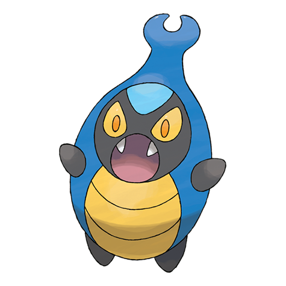

# Karrablast (#0588)

*Clamping Pokemon*

**Type:** Insetto
**Abilities:** [[Swarm]], [[Shed Skin]], [[No Guard]] *(Hidden)*
**Base HP:** 3

> When they feel threatened, they spit an acidic liquid to drive attackers away. This Pokemon targets Shelmet as they compete for food. It only evolves when it has a Shelmet's shell as its new home.

---

## Statistiche (Attributes & Limits)

| Attribute | Base / Limit |
|---|---|
| **Strength** | 2/5 |
| **Dexterity** | 2/4 |
| **Vitality** | 2/4 |
| **Special** | 1/3 |
| **Insight** | 2/4 |

---

## Mosse (Learnset)

- **Starter:** [[Peck|Peck]], [[Leer|Leer]]
- **Beginner:** [[Endure|Endure]], [[Fury_Cutter|Fury Cutter]]
- **Amateur:** [[Fury_Attack|Fury Attack]], [[Headbutt|Headbutt]], [[False_Swipe|False Swipe]], [[Bug_Buzz|Bug Buzz]], [[Slash|Slash]], [[Take_Down|Take Down]], [[Scary_Face|Scary Face]]
- **Ace:** [[X_Scissor|X-Scissor]], [[Flail|Flail]], [[Swords_Dance|Swords Dance]], [[Double_Edge|Double-Edge]]
- **Pro:** [[Feint_Attack|Feint Attack]], [[Horn_Attack|Horn Attack]], [[Pursuit|Pursuit]]

---

## Correlati

### Catena Evolutiva
- [[0588_Karrablast|Karrablast]]
- [[0589_Escavalier|Escavalier]]

