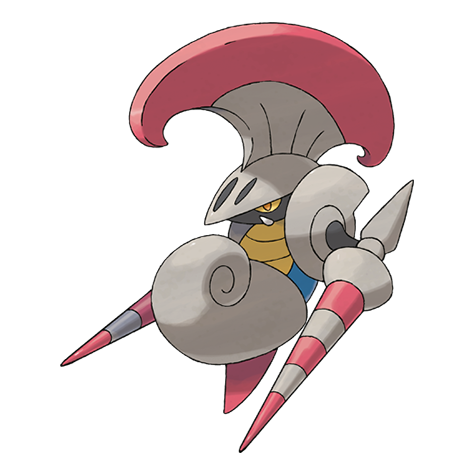

# Escavalier (#0589)

*Cavalry Pokemon*

**Type:** Insetto / Acciaio
**Abilities:** [[Swarm]], [[Shell Armor]], [[Overcoat]] *(Hidden)*
**Base HP:** 4

> Wearing the shell covering it stole from a Shelmet, it defends itself and attacks with two stings. It can fly to move around but its wings are too small to carry its weight to high altitudes.

---

## Statistiche (Attributes & Limits)

| Attribute | Base / Limit |
|---|---|
| **Strength** | 3/7 |
| **Dexterity** | 1/3 |
| **Vitality** | 3/6 |
| **Special** | 2/4 |
| **Insight** | 3/6 |

---

## Mosse (Learnset)

- **Starter:** [[Peck|Peck]], [[Leer|Leer]]
- **Beginner:** [[Quick_Guard|Quick Guard]], [[Twineedle|Twineedle]], [[Fell_Stinger|Fell Stinger]]
- **Amateur:** [[Fury_Attack|Fury Attack]], [[False_Swipe|False Swipe]], [[Headbutt|Headbutt]], [[Slash|Slash]], [[Bug_Buzz|Bug Buzz]], [[Iron_Defense|Iron Defense]], [[Iron_Head|Iron Head]]
- **Ace:** [[Double_Edge|Double-Edge]], [[X_Scissor|X-Scissor]], [[Reversal|Reversal]], [[Swords_Dance|Swords Dance]], [[Giga_Impact|Giga Impact]]
- **Pro:** [[Megahorn|Megahorn]], [[Drill_Run|Drill Run]], [[Counter|Counter]]

---

## Correlati

### Catena Evolutiva
- [[0588_Karrablast|Karrablast]]
- [[0589_Escavalier|Escavalier]]

