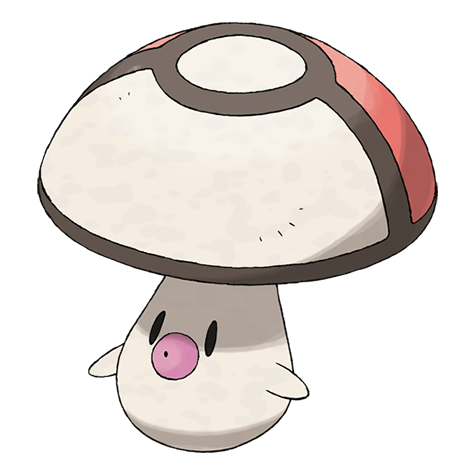

# Foongus (#0590)

*Mushroom Pokemon*

**Type:** Erba / Veleno
**Abilities:** [[Effect Spore]], [[Regenerator]] *(Hidden)*
**Base HP:** 3

> The top of fungus takes a pattern that resembles a predator to protect itself. In recent times this pattern has started to look like a Pokeball. It releases toxic spores in the air that help it move around safely.

---

## Statistiche (Attributes & Limits)

| Attribute | Base / Limit |
|---|---|
| **Strength** | 2/4 |
| **Dexterity** | 1/2 |
| **Vitality** | 2/4 |
| **Special** | 2/4 |
| **Insight** | 2/4 |

---

## Mosse (Learnset)

- **Starter:** [[Absorb|Absorb]], [[Growth|Growth]]
- **Beginner:** [[Astonish|Astonish]], [[Bide|Bide]]
- **Amateur:** [[Mega_Drain|Mega Drain]], [[Ingrain|Ingrain]], [[Feint_Attack|Feint Attack]], [[Sweet_Scent|Sweet Scent]], [[Synthesis|Synthesis]], [[Toxic|Toxic]], [[Clear_Smog|Clear Smog]]
- **Ace:** [[Giga_Drain|Giga Drain]], [[Solar_Beam|Solar Beam]], [[Rage_Powder|Rage Powder]], [[Spore|Spore]]
- **Pro:** [[Seed_Bomb|Seed Bomb]], [[Body_Slam|Body Slam]], [[Gastro_Acid|Gastro Acid]]

---

## Correlati

### Catena Evolutiva
- [[0590_Foongus|Foongus]]
- [[0591_Amoonguss|Amoonguss]]

