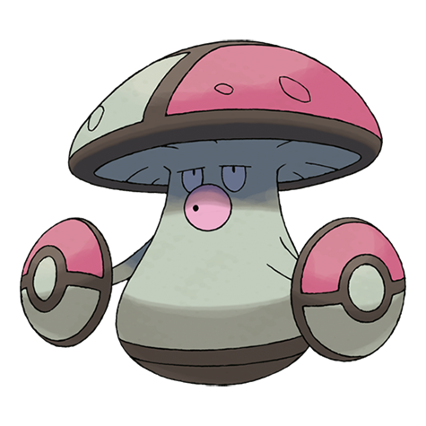

# Amoonguss (#0591)

*Mushroom Pokemon*

**Type:** Erba / Veleno
**Abilities:** [[Effect Spore]], [[Regenerator]] *(Hidden)*
**Base HP:** 4

> In ancient times the tip of their caps had two eye-like patterns and it made a swaying motion to lure prey to itself, but as they became Pokeball-looking few Pokemon fall for it. It is still very venomous, though.

---

## Statistiche (Attributes & Limits)

| Attribute | Base / Limit |
|---|---|
| **Strength** | 2/5 |
| **Dexterity** | 1/3 |
| **Vitality** | 2/5 |
| **Special** | 2/5 |
| **Insight** | 2/5 |

---

## Mosse (Learnset)

- **Starter:** [[Absorb|Absorb]], [[Growth|Growth]]
- **Beginner:** [[Astonish|Astonish]], [[Bide|Bide]]
- **Amateur:** [[Mega_Drain|Mega Drain]], [[Ingrain|Ingrain]], [[Feint_Attack|Feint Attack]], [[Sweet_Scent|Sweet Scent]], [[Synthesis|Synthesis]], [[Toxic|Toxic]], [[Clear_Smog|Clear Smog]]
- **Ace:** [[Giga_Drain|Giga Drain]], [[Solar_Beam|Solar Beam]], [[Rage_Powder|Rage Powder]], [[Spore|Spore]]
- **Pro:** [[Gastro_Acid|Gastro Acid]], [[Foul_Play|Foul Play]], [[Endure|Endure]]

---

## Correlati

### Catena Evolutiva
- [[0590_Foongus|Foongus]]
- [[0591_Amoonguss|Amoonguss]]

