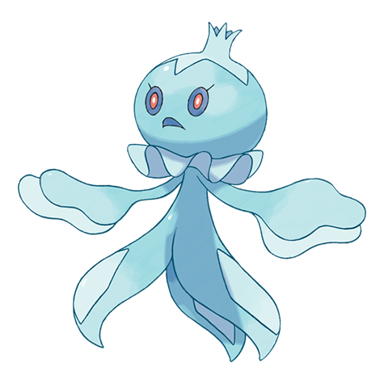

# Frillish (#0592)

*Floating Pokemon*

**Type:** Acqua / Spettro
**Abilities:** [[Water Absorb]], [[Cursed Body]], [[Damp]] *(Hidden)*
**Base HP:** 4

> If a Frillish is spotted, all beaches nearby will be closed for the day. This Pokemon paralizes a swimming victim and wraps them, dragging them to the bottom of the sea. Females have pink shade.

---

## Statistiche (Attributes & Limits)

| Attribute | Base / Limit |
|---|---|
| **Strength** | 1/3 |
| **Dexterity** | 1/3 |
| **Vitality** | 2/4 |
| **Special** | 2/4 |
| **Insight** | 2/5 |

---

## Mosse (Learnset)

- **Starter:** [[Bubble|Bubble]], [[Water_Sport|Water Sport]]
- **Beginner:** [[Absorb|Absorb]], [[Night_Shade|Night Shade]], [[Bubble_Beam|Bubble Beam]]
- **Amateur:** [[Recover|Recover]], [[Water_Pulse|Water Pulse]], [[Ominous_Wind|Ominous Wind]], [[Brine|Brine]], [[Rain_Dance|Rain Dance]]
- **Ace:** [[Hex|Hex]], [[Hydro_Pump|Hydro Pump]], [[Wring_Out|Wring Out]], [[Water_Spout|Water Spout]]
- **Pro:** [[Acid_Armor|Acid Armor]], [[Giga_Drain|Giga Drain]], [[Confuse_Ray|Confuse Ray]]

---

## Correlati

### Catena Evolutiva
- [[0592_Frillish|Frillish]]
- [[0593_Jellicent|Jellicent]]

