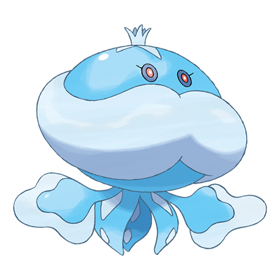

# Jellicent (#0593)

*Floating Pokemon*

**Type:** Acqua / Spettro
**Abilities:** [[Water Absorb]], [[Cursed Body]], [[Damp]] *(Hidden)*
**Base HP:** 5

> Its body is mostly seawater. It feeds on the life energy of its victims. It is regal, pompous, and hates orders. The fate of the ships and crew that wander into Jellicent's territory: All sunken, all lost, all vanished.

---

## Statistiche (Attributes & Limits)

| Attribute | Base / Limit |
|---|---|
| **Strength** | 2/4 |
| **Dexterity** | 2/4 |
| **Vitality** | 2/5 |
| **Special** | 2/5 |
| **Insight** | 3/6 |

---

## Mosse (Learnset)

- **Starter:** [[Bubble|Bubble]], [[Water_Sport|Water Sport]]
- **Beginner:** [[Absorb|Absorb]], [[Night_Shade|Night Shade]], [[Bubble_Beam|Bubble Beam]]
- **Amateur:** [[Recover|Recover]], [[Water_Pulse|Water Pulse]], [[Ominous_Wind|Ominous Wind]], [[Brine|Brine]], [[Rain_Dance|Rain Dance]]
- **Ace:** [[Wring_Out|Wring Out]], [[Water_Spout|Water Spout]], [[Hex|Hex]], [[Hydro_Pump|Hydro Pump]]
- **Pro:** [[Acid_Armor|Acid Armor]], [[Spite|Spite]], [[Confuse_Ray|Confuse Ray]]

---

## Correlati

### Catena Evolutiva
- [[0592_Frillish|Frillish]]
- [[0593_Jellicent|Jellicent]]

