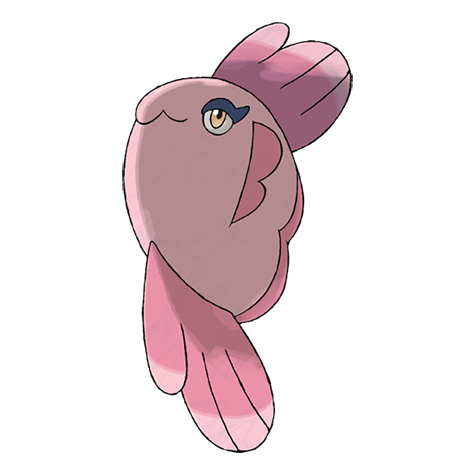

# Alomomola (#0594)

*Caring Pokemon*

**Type:** Acqua
**Abilities:** [[Healer]], [[Hydration]], [[Regenerator]] *(Hidden)*
**Base HP:** 8

> Floating in the open sea is how they live. When they find a wounded Pokemon, they embrace it and use their special membrane to heal their wounds. A caring, noble and selfless Pokemon.

---

## Statistiche (Attributes & Limits)

| Attribute | Base / Limit |
|---|---|
| **Strength** | 2/5 |
| **Dexterity** | 2/4 |
| **Vitality** | 2/5 |
| **Special** | 1/3 |
| **Insight** | 2/4 |

---

## Mosse (Learnset)

- **Starter:** [[Water_Sport|Water Sport]], [[Pound|Pound]]
- **Beginner:** [[Aqua_Ring|Aqua Ring]], [[Play_Nice|Play Nice]], [[Aqua_Jet|Aqua Jet]]
- **Amateur:** [[Brine|Brine]], [[Double_Slap|Double Slap]], [[Heal_Pulse|Heal Pulse]], [[Protect|Protect]], [[Water_Pulse|Water Pulse]], [[Wake_Up_Slap|Wake-Up Slap]], [[Soak|Soak]], [[Wide_Guard|Wide Guard]]
- **Ace:** [[Wish|Wish]], [[Safeguard|Safeguard]], [[Hydro_Pump|Hydro Pump]], [[Healing_Wish|Healing Wish]]
- **Pro:** [[Refresh|Refresh]], [[Pain_Split|Pain Split]], [[Endure|Endure]]

---

