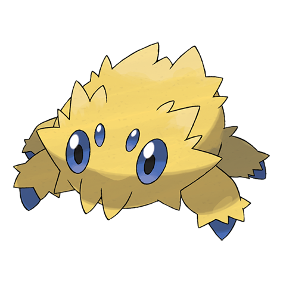

# Joltik (#0595)

*Attaching Pokemon*

**Type:** Insetto / Elettro
**Abilities:** [[Compound Eyes]], [[Unnerve]], [[Swarm]] *(Hidden)*
**Base HP:** 3

> Since it can’t generate its own charge, it sticks into larger Pokemon and absorbs the static electricity of their fur. In the cities they suck electricity from the outlets they find, skyrocketting the power bill.

---

## Statistiche (Attributes & Limits)

| Attribute | Base / Limit |
|---|---|
| **Strength** | 2/4 |
| **Dexterity** | 2/4 |
| **Vitality** | 2/4 |
| **Special** | 2/4 |
| **Insight** | 2/4 |

---

## Mosse (Learnset)

- **Starter:** [[String_Shot|String Shot]], [[Absorb|Absorb]]
- **Beginner:** [[Spider_Web|Spider Web]], [[Thunder_Wave|Thunder Wave]]
- **Amateur:** [[Screech|Screech]], [[Fury_Cutter|Fury Cutter]], [[Electroweb|Electroweb]], [[Bug_Bite|Bug Bite]], [[Gastro_Acid|Gastro Acid]], [[Slash|Slash]], [[Electro_Ball|Electro Ball]], [[Signal_Beam|Signal Beam]]
- **Ace:** [[Agility|Agility]], [[Sucker_Punch|Sucker Punch]], [[Discharge|Discharge]], [[Bug_Buzz|Bug Buzz]]
- **Pro:** [[Poison_Sting|Poison Sting]], [[Bounce|Bounce]], [[Giga_Drain|Giga Drain]]

---

## Correlati

### Catena Evolutiva
- [[0595_Joltik|Joltik]]
- [[0596_Galvantula|Galvantula]]

