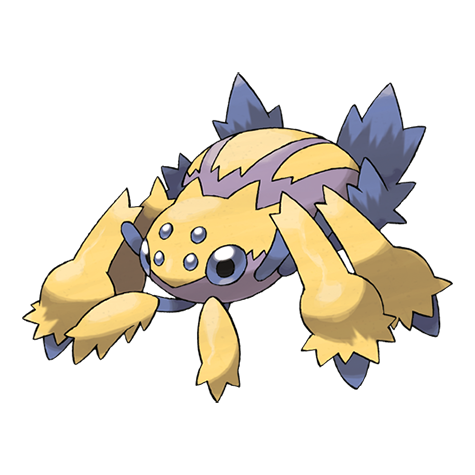

# Galvantula (#0596)

*EleSpider Pokemon*

**Type:** Insetto / Elettro
**Abilities:** [[Compound Eyes]], [[Unnerve]], [[Swarm]] *(Hidden)*
**Base HP:** 4

> They employ an electrically charged web to trap their prey. While it is immobilized by shock, they leisurely consume it. They usually live alone but there have been cases of large swarms living together in caves.

---

## Statistiche (Attributes & Limits)

| Attribute | Base / Limit |
|---|---|
| **Strength** | 2/5 |
| **Dexterity** | 2/5 |
| **Vitality** | 2/4 |
| **Special** | 3/6 |
| **Insight** | 2/4 |

---

## Mosse (Learnset)

- **Starter:** [[Absorb|Absorb]], [[String_Shot|String Shot]]
- **Beginner:** [[Thunder_Wave|Thunder Wave]], [[Spider_Web|Spider Web]]
- **Amateur:** [[Sticky_Web|Sticky Web]], [[Screech|Screech]], [[Fury_Cutter|Fury Cutter]], [[Electroweb|Electroweb]], [[Bug_Bite|Bug Bite]], [[Gastro_Acid|Gastro Acid]], [[Slash|Slash]], [[Electro_Ball|Electro Ball]], [[Signal_Beam|Signal Beam]]
- **Ace:** [[Agility|Agility]], [[Sucker_Punch|Sucker Punch]], [[Discharge|Discharge]], [[Bug_Buzz|Bug Buzz]]
- **Pro:** [[Cross_Poison|Cross Poison]], [[Magnet_Rise|Magnet Rise]], [[Giga_Drain|Giga Drain]]

---

## Correlati

### Catena Evolutiva
- [[0595_Joltik|Joltik]]
- [[0596_Galvantula|Galvantula]]

