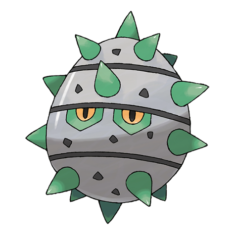

# Ferroseed (#0597)

*Thorn Seed Pokemon*

**Type:** Erba / Acciaio
**Abilities:** [[Iron Barbs]]
**Base HP:** 3

> They stick their thorns into cave walls and absorb the minerals from the rocks. When threatened, they attack by shooting a barrage of spikes, which gives them a chance to escape by rolling away.

---

## Statistiche (Attributes & Limits)

| Attribute | Base / Limit |
|---|---|
| **Strength** | 2/4 |
| **Dexterity** | 1/2 |
| **Vitality** | 2/5 |
| **Special** | 1/3 |
| **Insight** | 2/5 |

---

## Mosse (Learnset)

- **Starter:** [[Tackle|Tackle]], [[Harden|Harden]]
- **Beginner:** [[Rollout|Rollout]], [[Curse|Curse]]
- **Amateur:** [[Metal_Claw|Metal Claw]], [[Pin_Missile|Pin Missile]], [[Gyro_Ball|Gyro Ball]], [[Iron_Defense|Iron Defense]], [[Mirror_Shot|Mirror Shot]], [[Ingrain|Ingrain]], [[Self_Destruct|Self Destruct]]
- **Ace:** [[Iron_Head|Iron Head]], [[Payback|Payback]], [[Flash_Cannon|Flash Cannon]], [[Explosion|Explosion]]
- **Pro:** [[Leech_Seed|Leech Seed]], [[Spikes|Spikes]], [[Seed_Bomb|Seed Bomb]]

---

## Correlati

### Catena Evolutiva
- [[0597_Ferroseed|Ferroseed]]
- [[0598_Ferrothorn|Ferrothorn]]

