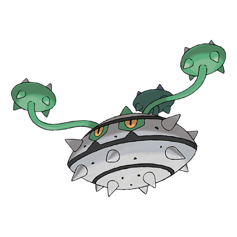

# Ferrothorn (#0598)

*Thorn Pod Pokemon*

**Type:** Erba / Acciaio
**Abilities:** [[Iron Barbs]], [[Anticipation]] *(Hidden)*
**Base HP:** 4

> It attaches itself to cave ceilings by swinging around its spiky feelers. It shoots spikes at targets passing beneath. It is incredibly resilient and stubborn, it will whip you if you try to take its spot in the cave walls..

---

## Statistiche (Attributes & Limits)

| Attribute | Base / Limit |
|---|---|
| **Strength** | 3/6 |
| **Dexterity** | 1/3 |
| **Vitality** | 3/7 |
| **Special** | 2/4 |
| **Insight** | 3/6 |

---

## Mosse (Learnset)

- **Starter:** [[Harden|Harden]], [[Tackle|Tackle]]
- **Beginner:** [[Curse|Curse]], [[Rollout|Rollout]]
- **Amateur:** [[Rock_Climb|Rock Climb]], [[Metal_Claw|Metal Claw]], [[Pin_Missile|Pin Missile]], [[Gyro_Ball|Gyro Ball]], [[Iron_Defense|Iron Defense]], [[Mirror_Shot|Mirror Shot]], [[Ingrain|Ingrain]], [[Self_Destruct|Self Destruct]], [[Power_Whip|Power Whip]]
- **Ace:** [[Iron_Head|Iron Head]], [[Payback|Payback]], [[Flash_Cannon|Flash Cannon]], [[Explosion|Explosion]]
- **Pro:** [[Leech_Seed|Leech Seed]], [[Stealth_Rock|Stealth Rock]], [[Seed_Bomb|Seed Bomb]]

---

## Correlati

### Catena Evolutiva
- [[0597_Ferroseed|Ferroseed]]
- [[0598_Ferrothorn|Ferrothorn]]

