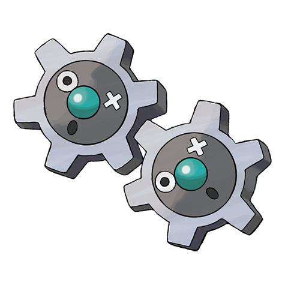

# Klink (#0599)

*Gear Pokemon*

**Type:** Acciaio
**Abilities:** [[Plus]], [[Minus]], [[Clear Body]] *(Hidden)*
**Base HP:** 3

> This two strange Pokemon are merged into one. Interlocking their bodies and spinning around will generate the energy they need to live. Their only way to communicate is through their eyes.

---

## Statistiche (Attributes & Limits)

| Attribute | Base / Limit |
|---|---|
| **Strength** | 2/4 |
| **Dexterity** | 1/3 |
| **Vitality** | 2/5 |
| **Special** | 2/4 |
| **Insight** | 2/4 |

---

## Mosse (Learnset)

- **Starter:** [[Vice_Grip|Vice Grip]]
- **Beginner:** [[Charge|Charge]], [[Thunder_Shock|Thunder Shock]]
- **Amateur:** [[Gear_Grind|Gear Grind]], [[Bind|Bind]], [[Charge_Beam|Charge Beam]], [[Autotomize|Autotomize]], [[Mirror_Shot|Mirror Shot]], [[Screech|Screech]], [[Discharge|Discharge]], [[Metal_Sound|Metal Sound]]
- **Ace:** [[Shift_Gear|Shift Gear]], [[Lock_On|Lock-On]], [[Zap_Cannon|Zap Cannon]], [[Hyper_Beam|Hyper Beam]]
- **Pro:** [[Iron_Defense|Iron Defense]], [[Magnet_Rise|Magnet Rise]], [[Gravity|Gravity]]

---

## Correlati

### Catena Evolutiva
- [[0599_Klink|Klink]]
- [[0600_Klang|Klang]]
- [[0601_Klinklang|Klinklang]]

