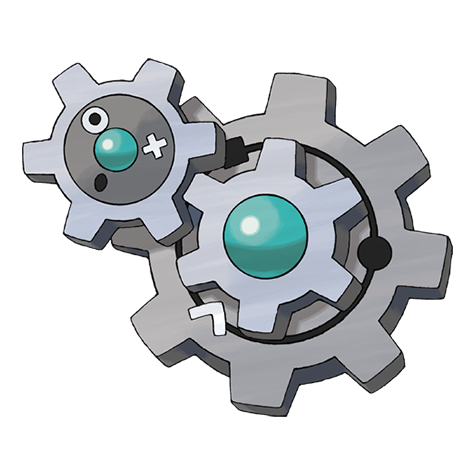

# Klang (#0600)

*Gear Pokemon*

**Type:** Acciaio
**Abilities:** [[Plus]], [[Minus]], [[Clear Body]] *(Hidden)*
**Base HP:** 4

> Minigear and big gear comprise its body. If the minigear is detached it will turn off both gears. It communicates with others by rotating. When its angry or afraid, it rotates faster.

---

## Statistiche (Attributes & Limits)

| Attribute | Base / Limit |
|---|---|
| **Strength** | 2/5 |
| **Dexterity** | 2/4 |
| **Vitality** | 3/6 |
| **Special** | 2/5 |
| **Insight** | 2/5 |

---

## Mosse (Learnset)

- **Starter:** [[Vice_Grip|Vice Grip]]
- **Beginner:** [[Charge|Charge]], [[Thunder_Shock|Thunder Shock]]
- **Amateur:** [[Gear_Grind|Gear Grind]], [[Bind|Bind]], [[Charge_Beam|Charge Beam]], [[Autotomize|Autotomize]], [[Mirror_Shot|Mirror Shot]], [[Screech|Screech]], [[Discharge|Discharge]], [[Metal_Sound|Metal Sound]]
- **Ace:** [[Shift_Gear|Shift Gear]], [[Lock_On|Lock-On]], [[Zap_Cannon|Zap Cannon]], [[Hyper_Beam|Hyper Beam]]
- **Pro:** [[Iron_Defense|Iron Defense]], [[Magnet_Rise|Magnet Rise]], [[Gravity|Gravity]]

---

## Correlati

### Catena Evolutiva
- [[0599_Klink|Klink]]
- [[0600_Klang|Klang]]
- [[0601_Klinklang|Klinklang]]

