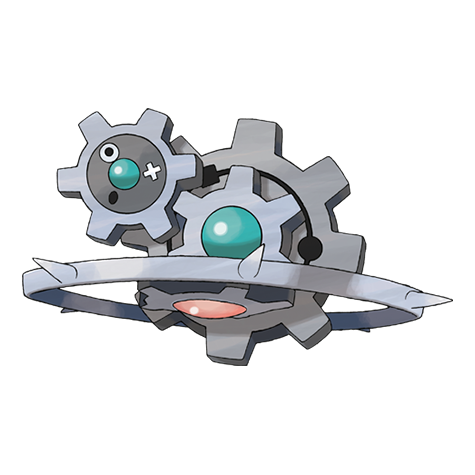

# Klinklang (#0601)

*Gear Pokemon*

**Type:** Acciaio
**Abilities:** [[Plus]], [[Minus]], [[Clear Body]] *(Hidden)*
**Base HP:** 5

> The gear with the red core rotates at high speed for a quick energy charge. The mini gears shoot rays through the spikes around it. This inorganic Pokemon will trap and crush foes between its gears.

---

## Statistiche (Attributes & Limits)

| Attribute | Base / Limit |
|---|---|
| **Strength** | 3/6 |
| **Dexterity** | 2/5 |
| **Vitality** | 3/6 |
| **Special** | 2/5 |
| **Insight** | 2/5 |

---

## Mosse (Learnset)

- **Starter:** [[Vice_Grip|Vice Grip]]
- **Beginner:** [[Charge|Charge]], [[Thunder_Shock|Thunder Shock]]
- **Amateur:** [[Gear_Grind|Gear Grind]], [[Gear_Up|Gear Up]], [[Magnetic_Flux|Magnetic Flux]], [[Bind|Bind]], [[Charge_Beam|Charge Beam]], [[Autotomize|Autotomize]], [[Mirror_Shot|Mirror Shot]], [[Screech|Screech]], [[Discharge|Discharge]], [[Metal_Sound|Metal Sound]]
- **Ace:** [[Shift_Gear|Shift Gear]], [[Lock_On|Lock-On]], [[Zap_Cannon|Zap Cannon]], [[Hyper_Beam|Hyper Beam]]
- **Pro:** [[Iron_Defense|Iron Defense]], [[Gravity|Gravity]], [[Magnet_Rise|Magnet Rise]]

---

## Correlati

### Catena Evolutiva
- [[0599_Klink|Klink]]
- [[0600_Klang|Klang]]
- [[0601_Klinklang|Klinklang]]

