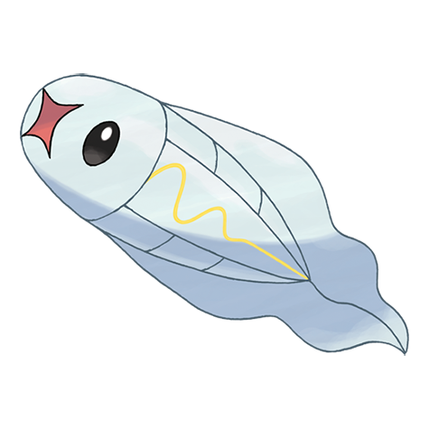

# Tynamo (#0602)

*EleFish Pokemon*

**Type:** Elettro
**Abilities:** [[Levitate]]
**Base HP:** 3

> These Pokemon move in schools. They have an electricity-storing organ at their sides but they can’t generate their own power. They only discharge electricity if they are in danger.

---

## Statistiche (Attributes & Limits)

| Attribute | Base / Limit |
|---|---|
| **Strength** | 2/4 |
| **Dexterity** | 1/3 |
| **Vitality** | 2/4 |
| **Special** | 2/4 |
| **Insight** | 1/3 |

---

## Mosse (Learnset)

- **Starter:** [[Tackle|Tackle]]
- **Beginner:** [[Thunder_Wave|Thunder Wave]]
- **Amateur:** [[Spark|Spark]]
- **Ace:** [[Charge_Beam|Charge Beam]]

---

## Correlati

### Catena Evolutiva
- [[0602_Tynamo|Tynamo]]
- [[0603_Eelektrik|Eelektrik]]
- [[0604_Eelektross|Eelektross]]

