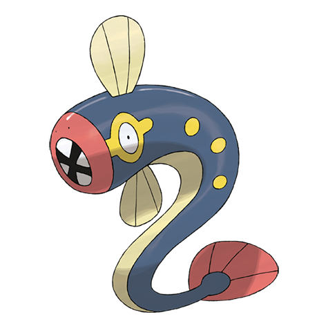

# Eelektrik (#0603)

*EleFish Pokemon*

**Type:** Elettro
**Abilities:** [[Levitate]]
**Base HP:** 4

> These Pokemon have a really big appetite. When they spot their prey, they coil around it and shock it with their electricity-generating organs, which are the yellow circles on it’s skin.

---

## Statistiche (Attributes & Limits)

| Attribute | Base / Limit |
|---|---|
| **Strength** | 2/5 |
| **Dexterity** | 1/3 |
| **Vitality** | 2/5 |
| **Special** | 2/5 |
| **Insight** | 2/5 |

---

## Mosse (Learnset)

- **Starter:** [[Spark|Spark]], [[Thunder_Wave|Thunder Wave]]
- **Beginner:** [[Bind|Bind]], [[Charge_Beam|Charge Beam]]
- **Amateur:** [[Headbutt|Headbutt]], [[Acid|Acid]], [[Discharge|Discharge]], [[Crunch|Crunch]], [[Thunderbolt|Thunderbolt]], [[Acid_Spray|Acid Spray]], [[Coil|Coil]]
- **Ace:** [[Wild_Charge|Wild Charge]], [[Gastro_Acid|Gastro Acid]], [[Zap_Cannon|Zap Cannon]], [[Thrash|Thrash]]
- **Pro:** [[Giga_Drain|Giga Drain]], [[Aqua_Tail|Aqua Tail]], [[Iron_Tail|Iron Tail]]

---

## Correlati

### Catena Evolutiva
- [[0602_Tynamo|Tynamo]]
- [[0603_Eelektrik|Eelektrik]]
- [[0604_Eelektross|Eelektross]]

