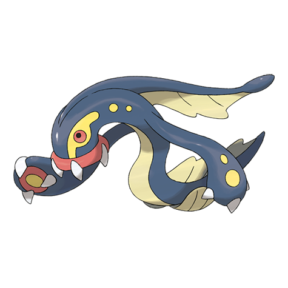

# Eelektross (#0604)

*EleFish Pokemon*

**Type:** Elettro
**Abilities:** [[Levitate]]
**Base HP:** 5

> They crawl out of the water and attack anyone on shore by sucking them into their mouths, shocking them, and dragging them back into the ocean. They are aggressive and unpredictable, be very careful

---

## Statistiche (Attributes & Limits)

| Attribute | Base / Limit |
|---|---|
| **Strength** | 3/6 |
| **Dexterity** | 2/4 |
| **Vitality** | 2/5 |
| **Special** | 3/6 |
| **Insight** | 2/5 |

---

## Mosse (Learnset)

- **Starter:** [[Crush_Claw|Crush Claw]], [[Ion_Deluge|Ion Deluge]]
- **Beginner:** [[Headbutt|Headbutt]], [[Acid|Acid]]
- **Amateur:** [[Discharge|Discharge]], [[Crunch|Crunch]], [[Coil|Coil]]
- **Ace:** [[Gastro_Acid|Gastro Acid]], [[Zap_Cannon|Zap Cannon]], [[Thrash|Thrash]]
- **Pro:** [[Super_Fang|Super Fang]], [[Drain_Punch|Drain Punch]], [[Fire_Punch|Fire Punch]]

---

## Correlati

### Catena Evolutiva
- [[0602_Tynamo|Tynamo]]
- [[0603_Eelektrik|Eelektrik]]
- [[0604_Eelektross|Eelektross]]

