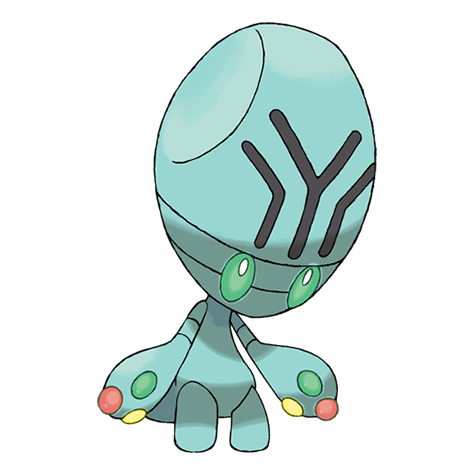

# Elgyem (#0605)

*Cerebral Pokemon*

**Type:** Psico
**Abilities:** [[Telepathy]], [[Synchronize]], [[Analytic]] *(Hidden)*
**Base HP:** 3

> This Pokemon was never seen until it appeared far in the desert about 50 years ago. Rumor has it that it came from space. It uses its strong psychic power to squeeze its foe’s brain, causing awful headaches.

---

## Statistiche (Attributes & Limits)

| Attribute | Base / Limit |
|---|---|
| **Strength** | 2/4 |
| **Dexterity** | 1/3 |
| **Vitality** | 2/4 |
| **Special** | 2/5 |
| **Insight** | 2/4 |

---

## Mosse (Learnset)

- **Starter:** [[Confusion|Confusion]], [[Growl|Growl]]
- **Beginner:** [[Heal_Block|Heal Block]], [[Miracle_Eye|Miracle Eye]]
- **Amateur:** [[Psybeam|Psybeam]], [[Headbutt|Headbutt]], [[Hidden_Power|Hidden Power]], [[Imprison|Imprison]], [[Simple_Beam|Simple Beam]], [[Zen_Headbutt|Zen Headbutt]], [[Psych_Up|Psych Up]], [[Recover|Recover]], [[Calm_Mind|Calm Mind]], [[Wonder_Room|Wonder Room]]
- **Ace:** [[Guard_Split|Guard Split]], [[Power_Split|Power Split]], [[Synchronoise|Synchronoise]], [[Psychic|Psychic]]
- **Pro:** [[Cosmic_Power|Cosmic Power]], [[Nasty_Plot|Nasty Plot]], [[Teleport|Teleport]]

---

## Correlati

### Catena Evolutiva
- [[0605_Elgyem|Elgyem]]
- [[0606_Beheeyem|Beheeyem]]

