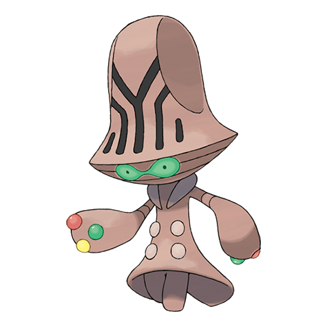

# Beheeyem (#0606)

*Cerebral Pokemon*

**Type:** Psico
**Abilities:** [[Telepathy]], [[Synchronize]], [[Analytic]] *(Hidden)*
**Base HP:** 4

> Apparently, it communicates by flashing its three fingers, but the patterns haven’t been decoded. It uses psychic power to control an opponent’s brain and tampers with its memories and personality.

---

## Statistiche (Attributes & Limits)

| Attribute | Base / Limit |
|---|---|
| **Strength** | 2/5 |
| **Dexterity** | 1/3 |
| **Vitality** | 2/5 |
| **Special** | 3/7 |
| **Insight** | 3/6 |

---

## Mosse (Learnset)

- **Starter:** [[Confusion|Confusion]], [[Growl|Growl]]
- **Beginner:** [[Heal_Block|Heal Block]], [[Miracle_Eye|Miracle Eye]]
- **Amateur:** [[Psychic_Terrain|Psychic Terrain]], [[Headbutt|Headbutt]], [[Psybeam|Psybeam]], [[Imprison|Imprison]], [[Hidden_Power|Hidden Power]], [[Zen_Headbutt|Zen Headbutt]], [[Simple_Beam|Simple Beam]], [[Recover|Recover]], [[Psych_Up|Psych Up]], [[Wonder_Room|Wonder Room]], [[Calm_Mind|Calm Mind]]
- **Ace:** [[Guard_Split|Guard Split]], [[Power_Split|Power Split]], [[Synchronoise|Synchronoise]], [[Psychic|Psychic]]
- **Pro:** [[Cosmic_Power|Cosmic Power]], [[Nasty_Plot|Nasty Plot]], [[Teleport|Teleport]]

---

## Correlati

### Catena Evolutiva
- [[0605_Elgyem|Elgyem]]
- [[0606_Beheeyem|Beheeyem]]

