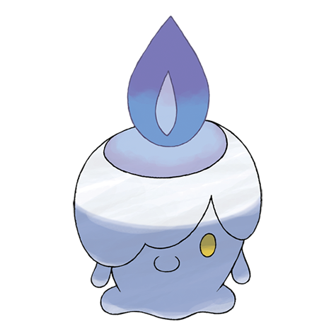

# Litwick (#0607)

*Candle Pokemon*

**Type:** Spettro / Fuoco
**Abilities:** [[Flash Fire]], [[Flame Body]], [[Infiltrator]] *(Hidden)*
**Base HP:** 3

> Its flame is usually out, but it starts burning whenever it absorbs the life force from others. They trick lost people into thinking they are helping them find their way in the dark but those who follow them never return.

---

## Statistiche (Attributes & Limits)

| Attribute | Base / Limit |
|---|---|
| **Strength** | 1/3 |
| **Dexterity** | 1/3 |
| **Vitality** | 2/4 |
| **Special** | 2/4 |
| **Insight** | 2/4 |

---

## Mosse (Learnset)

- **Starter:** [[Ember|Ember]], [[Astonish|Astonish]], [[Minimize|Minimize]]
- **Beginner:** [[Smog|Smog]], [[Fire_Spin|Fire Spin]], [[Confuse_Ray|Confuse Ray]]
- **Amateur:** [[Night_Shade|Night Shade]], [[Will_O_Wisp|Will-O-Wisp]], [[Flame_Burst|Flame Burst]], [[Imprison|Imprison]], [[Hex|Hex]], [[Memento|Memento]]
- **Ace:** [[Inferno|Inferno]], [[Curse|Curse]], [[Shadow_Ball|Shadow Ball]], [[Pain_Split|Pain Split]], [[Overheat|Overheat]]
- **Pro:** [[Clear_Smog|Clear Smog]], [[Trick|Trick]], [[Haze|Haze]]

---

## Correlati

### Catena Evolutiva
- [[0607_Litwick|Litwick]]
- [[0608_Lampent|Lampent]]
- [[0609_Chandelure|Chandelure]]

