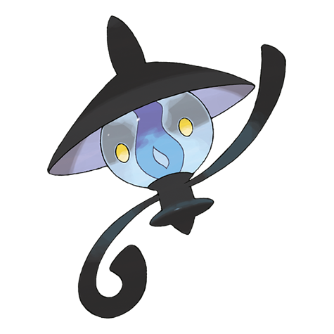

# Lampent (#0608)

*Lamp Pokemon*

**Type:** Spettro / Fuoco
**Abilities:** [[Flash Fire]], [[Flame Body]], [[Infiltrator]] *(Hidden)*
**Base HP:** 4

> This ominous Pokemon is very feared. It always arrives at someone’s final moments and steals their spirit. It hangs close to hospitals and other places simply waiting. It is said that if it gets your soul you will never rest.

---

## Statistiche (Attributes & Limits)

| Attribute | Base / Limit |
|---|---|
| **Strength** | 1/3 |
| **Dexterity** | 2/4 |
| **Vitality** | 2/4 |
| **Special** | 3/6 |
| **Insight** | 2/4 |

---

## Mosse (Learnset)

- **Starter:** [[Ember|Ember]], [[Astonish|Astonish]], [[Minimize|Minimize]]
- **Beginner:** [[Smog|Smog]], [[Fire_Spin|Fire Spin]], [[Confuse_Ray|Confuse Ray]]
- **Amateur:** [[Night_Shade|Night Shade]], [[Will_O_Wisp|Will-O-Wisp]], [[Flame_Burst|Flame Burst]], [[Imprison|Imprison]], [[Hex|Hex]], [[Memento|Memento]]
- **Ace:** [[Inferno|Inferno]], [[Curse|Curse]], [[Shadow_Ball|Shadow Ball]], [[Pain_Split|Pain Split]], [[Overheat|Overheat]]
- **Pro:** [[Clear_Smog|Clear Smog]], [[Power_Split|Power Split]], [[Haze|Haze]]

---

## Correlati

### Catena Evolutiva
- [[0607_Litwick|Litwick]]
- [[0608_Lampent|Lampent]]
- [[0609_Chandelure|Chandelure]]

