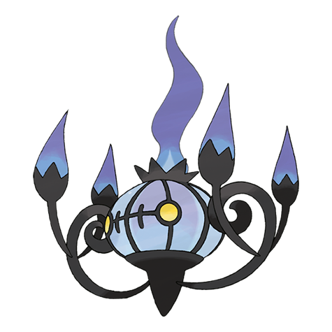

# Chandelure (#0609)

*Luring Pokemon*

**Type:** Spettro / Fuoco
**Abilities:** [[Flash Fire]], [[Flame Body]], [[Infiltrator]] *(Hidden)*
**Base HP:** 5

> It consumes the spirits of the living, puts people in a hypnotic trance and consumes them with fire. Being consumed in Chandelure's flame burns up the spirit, leaving only the body behind.

---

## Statistiche (Attributes & Limits)

| Attribute | Base / Limit |
|---|---|
| **Strength** | 2/4 |
| **Dexterity** | 2/4 |
| **Vitality** | 2/5 |
| **Special** | 4/8 |
| **Insight** | 2/5 |

---

## Mosse (Learnset)

- **Starter:** [[Confuse_Ray|Confuse Ray]]
- **Beginner:** [[Smog|Smog]]
- **Amateur:** [[Pain_Split|Pain Split]], [[Flame_Burst|Flame Burst]], [[Hex|Hex]]
- **Pro:** [[Power_Split|Power Split]], [[Acid_Armor|Acid Armor]], [[Clear_Smog|Clear Smog]]

---

## Correlati

### Catena Evolutiva
- [[0607_Litwick|Litwick]]
- [[0608_Lampent|Lampent]]
- [[0609_Chandelure|Chandelure]]

