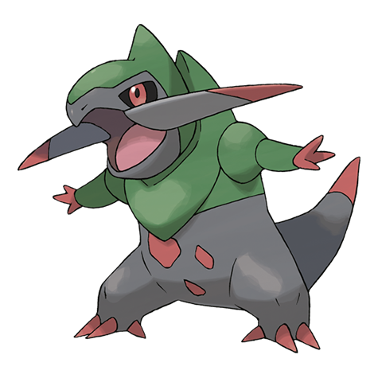

# Fraxure (#0611)

*Axe Jaw Pokemon*

**Type:** Drago
**Abilities:** [[Rivalry]], [[Mold Breaker]], [[Unnerve]] *(Hidden)*
**Base HP:** 4

> Their tusks can shatter rocks. Territory battles between Fraxure can be intensely violent. The tusks don’t grow back anymore, if you find a Fraxure with both tusks whole, it means it’s one of the strongest.

---

## Statistiche (Attributes & Limits)

| Attribute | Base / Limit |
|---|---|
| **Strength** | 3/6 |
| **Dexterity** | 2/4 |
| **Vitality** | 2/5 |
| **Special** | 1/3 |
| **Insight** | 2/4 |

---

## Mosse (Learnset)

- **Starter:** [[Scratch|Scratch]], [[Leer|Leer]]
- **Beginner:** [[Assurance|Assurance]], [[Dragon_Rage|Dragon Rage]]
- **Amateur:** [[Dual_Chop|Dual Chop]], [[Scary_Face|Scary Face]], [[Slash|Slash]], [[False_Swipe|False Swipe]], [[Dragon_Claw|Dragon Claw]], [[Dragon_Dance|Dragon Dance]], [[Taunt|Taunt]], [[Dragon_Pulse|Dragon Pulse]], [[Swords_Dance|Swords Dance]]
- **Ace:** [[Guillotine|Guillotine]], [[Outrage|Outrage]], [[Giga_Impact|Giga Impact]]
- **Pro:** [[Focus_Energy|Focus Energy]], [[Counter|Counter]], [[Night_Slash|Night Slash]]

---

## Correlati

### Catena Evolutiva
- [[0610_Axew|Axew]]
- [[0611_Fraxure|Fraxure]]
- [[0612_Haxorus|Haxorus]]

