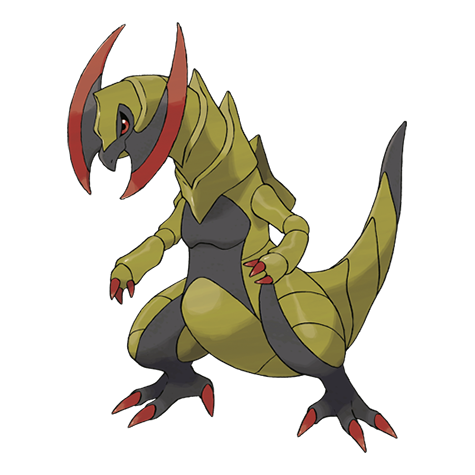

# Haxorus (#0612)

*Axe Jaw Pokemon*

**Type:** Drago
**Abilities:** [[Rivalry]], [[Mold Breaker]], [[Unnerve]] *(Hidden)*
**Base HP:** 5

> Their sturdy tusks will stay sharp even if they are used to cut steel. These Pokemon are covered in hard armor. They incredibly aggressive, if their territory is trespassed, they chase and slash mercilessly.

---

## Statistiche (Attributes & Limits)

| Attribute | Base / Limit |
|---|---|
| **Strength** | 4/8 |
| **Dexterity** | 3/6 |
| **Vitality** | 2/5 |
| **Special** | 2/4 |
| **Insight** | 2/5 |

---

## Mosse (Learnset)

- **Starter:** [[Scratch|Scratch]], [[Leer|Leer]]
- **Beginner:** [[Assurance|Assurance]], [[Dragon_Rage|Dragon Rage]]
- **Amateur:** [[Dual_Chop|Dual Chop]], [[Scary_Face|Scary Face]], [[Slash|Slash]], [[False_Swipe|False Swipe]], [[Dragon_Claw|Dragon Claw]], [[Dragon_Dance|Dragon Dance]], [[Taunt|Taunt]], [[Dragon_Pulse|Dragon Pulse]], [[Swords_Dance|Swords Dance]]
- **Ace:** [[Guillotine|Guillotine]], [[Outrage|Outrage]], [[Giga_Impact|Giga Impact]]
- **Pro:** [[Night_Slash|Night Slash]], [[Draco_Meteor|Draco Meteor]], [[Superpower|Superpower]]

---

## Correlati

### Catena Evolutiva
- [[0610_Axew|Axew]]
- [[0611_Fraxure|Fraxure]]
- [[0612_Haxorus|Haxorus]]

