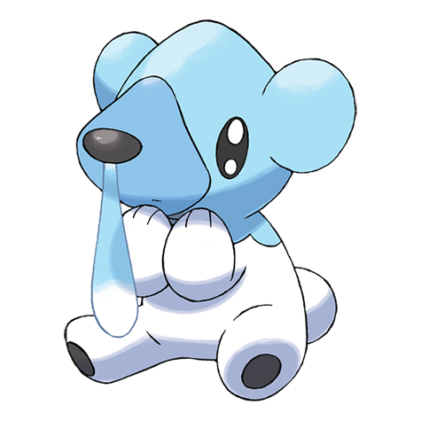

# Cubchoo (#0613)

*Chill Pokemon*

**Type:** Ghiaccio
**Abilities:** [[Snow Cloak]], [[Slush Rush]], [[Rattled]] *(Hidden)*
**Base HP:** 3

> They are born by the end of winter and stay with their mothers for a couple of seasons. Their running nose is used to practice their ice powers. In fact, when they get sick their nose is completely dry.

---

## Statistiche (Attributes & Limits)

| Attribute | Base / Limit |
|---|---|
| **Strength** | 2/5 |
| **Dexterity** | 1/3 |
| **Vitality** | 1/3 |
| **Special** | 2/4 |
| **Insight** | 1/3 |

---

## Mosse (Learnset)

- **Starter:** [[Growl|Growl]], [[Powder_Snow|Powder Snow]]
- **Beginner:** [[Bide|Bide]]
- **Amateur:** [[Icy_Wind|Icy Wind]], [[Play_Nice|Play Nice]], [[Fury_Swipes|Fury Swipes]], [[Brine|Brine]], [[Endure|Endure]], [[Charm|Charm]], [[Slash|Slash]], [[Flail|Flail]]
- **Ace:** [[Rest|Rest]], [[Blizzard|Blizzard]], [[Hail|Hail]], [[Thrash|Thrash]], [[Sheer_Cold|Sheer Cold]]
- **Pro:** [[Play_Rough|Play Rough]], [[Yawn|Yawn]], [[Ice_Punch|Ice Punch]]

---

## Correlati

### Catena Evolutiva
- [[0613_Cubchoo|Cubchoo]]
- [[0614_Beartic|Beartic]]

