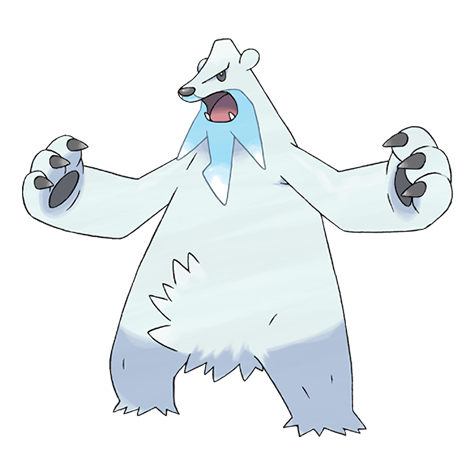

# Beartic (#0614)

*Freezing Pokemon*

**Type:** Ghiaccio
**Abilities:** [[Snow Cloak]], [[Slush Rush]], [[Swift Swim]] *(Hidden)*
**Base HP:** 4

> They the cold northern seas and create pathways across the ocean's water by freezing their own breath. They dive in the sea to catch prey. They are not used to humans as they rarely see one.

---

## Statistiche (Attributes & Limits)

| Attribute | Base / Limit |
|---|---|
| **Strength** | 3/6 |
| **Dexterity** | 2/4 |
| **Vitality** | 2/5 |
| **Special** | 2/5 |
| **Insight** | 2/5 |

---

## Mosse (Learnset)

- **Starter:** [[Growl|Growl]], [[Powder_Snow|Powder Snow]]
- **Beginner:** [[Bide|Bide]]
- **Amateur:** [[Icy_Wind|Icy Wind]], [[Icicle_Crash|Icicle Crash]], [[Aqua_Jet|Aqua Jet]], [[Play_Nice|Play Nice]], [[Fury_Swipes|Fury Swipes]], [[Brine|Brine]], [[Endure|Endure]], [[Slash|Slash]], [[Flail|Flail]]
- **Ace:** [[Superpower|Superpower]], [[Rest|Rest]], [[Blizzard|Blizzard]], [[Hail|Hail]], [[Thrash|Thrash]], [[Sheer_Cold|Sheer Cold]]
- **Pro:** [[Avalanche|Avalanche]], [[Night_Slash|Night Slash]], [[Play_Rough|Play Rough]]

---

## Correlati

### Catena Evolutiva
- [[0613_Cubchoo|Cubchoo]]
- [[0614_Beartic|Beartic]]

