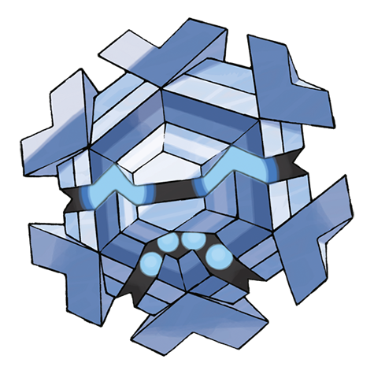

# Cryogonal (#0615)

*Crystallizing Pokemon*

**Type:** Ghiaccio
**Abilities:** [[Levitate]]
**Base HP:** 4

> They are born in snow clouds. Using chains made of ice crystals they capture prey. If their body temperature goes up, they turns into steam and vanish until it freezes and becomes ice again.

---

## Statistiche (Attributes & Limits)

| Attribute | Base / Limit |
|---|---|
| **Strength** | 2/4 |
| **Dexterity** | 3/6 |
| **Vitality** | 1/3 |
| **Special** | 3/6 |
| **Insight** | 3/7 |

---

## Mosse (Learnset)

- **Starter:** [[Ice_Shard|Ice Shard]], [[Mist|Mist]]
- **Beginner:** [[Haze|Haze]], [[Bind|Bind]], [[Sharpen|Sharpen]]
- **Amateur:** [[Rapid_Spin|Rapid Spin]], [[Icy_Wind|Icy Wind]], [[Aurora_Beam|Aurora Beam]], [[Acid_Armor|Acid Armor]], [[Ice_Beam|Ice Beam]], [[Light_Screen|Light Screen]], [[Reflect|Reflect]], [[Slash|Slash]], [[Freeze_Dry|Freeze Dry]], [[Recover|Recover]]
- **Ace:** [[Confuse_Ray|Confuse Ray]], [[Solar_Beam|Solar Beam]], [[Night_Slash|Night Slash]], [[Sheer_Cold|Sheer Cold]]
- **Pro:** [[Knock_Off|Knock Off]], [[Signal_Beam|Signal Beam]], [[Magic_Coat|Magic Coat]]

---

